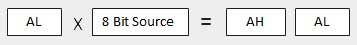
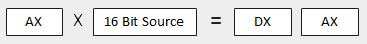
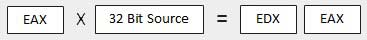
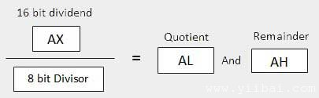
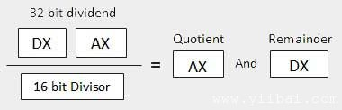
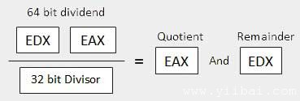

# Assembly 算术指令 - Assembly汇编

## INC指令

INC指令是一个用于操作数递增。它可以在一个单一的操作数，可以是在一个寄存器或内存。

### 语法:

INC指令的语法如下：

```
INC destination
```

操作数目标可能是8位，16位或32位操作数。

### 例子:

```
INC EBX	     ; Increments 32-bit register
INC DL       ; Increments 8-bit register
INC [count]  ; Increments the count variable
```

## DEC指令

DEC指令用于由一个操作数递减。它可以在一个单一的操作数，可以是在一个寄存器或内存。

### 语法:

DEC指令的语法如下：

```
DEC destination
```

操作数目标可以是8位，16位或32位操作数。

### 例子:

```
segment .data
	count dw  0
	value db  15
segment .text
	inc [count]
	dec [value]
	mov ebx, count
	inc word [ebx]
	mov esi, value
	dec byte [esi]
```

## ADD和SUB指令

ADD和SUB指令用于执行二进制数据字节，字和双字的大小，即简单的加法/减法，8位，16位或32位操作数分别相加或相减。

### 语法:

ADD和SUB指令的语法如下：

```
ADD/SUB	destination, source
```

ADD/ SUB指令之间可能发生：

*   寄存器到寄存器

*   内存到寄存器

*   寄存器到内存

*   寄存器到常量数据

*   内存到常量数据

然而，像其他指令，内存到内存的操作是不可能使用ADD/ SUB指令。 ADD或SUB操作设置或清除溢出和进位标志。

### 例子:

下面的例子会从用户要求的两个数字，分别在EAX和EBX寄存器存储的数字，增加值，并将结果存储在一个内存位置'清晰度'，并最终显示结果。

```
SYS_EXIT  equ 1
SYS_READ  equ 3
SYS_WRITE equ 4
STDIN     equ 0
STDOUT    equ 1

segment .data 

    msg1 db "Enter a digit ", 0xA,0xD 
    len1 equ $- msg1 

    msg2 db "Please enter a second digit", 0xA,0xD 
    len2 equ $- msg2 

    msg3 db "The sum is: "
    len3 equ $- msg3

segment .bss

    num1 resb 2 
    num2 resb 2 
    res resb 1    

section	.text
    global _start    ;must be declared for using gcc
_start:    ;tell linker entry yiibai
    mov eax, SYS_WRITE         
    mov ebx, STDOUT         
    mov ecx, msg1         
    mov edx, len1 
    int 0x80                

    mov eax, SYS_READ 
    mov ebx, STDIN  
    mov ecx, num1 
    mov edx, 2
    int 0x80            

    mov eax, SYS_WRITE        
    mov ebx, STDOUT         
    mov ecx, msg2          
    mov edx, len2         
    int 0x80

    mov eax, SYS_READ  
    mov ebx, STDIN  
    mov ecx, num2 
    mov edx, 2
    int 0x80        

    mov eax, SYS_WRITE         
    mov ebx, STDOUT         
    mov ecx, msg3          
    mov edx, len3         
    int 0x80

    ; moving the first number to eax register and second number to ebx
    ; and subtracting ascii '0' to convert it into a decimal number
    mov eax, [number1]
    sub eax, '0'
    mov ebx, [number2]
    sub ebx, '0'

    ; add eax and ebx
    add eax, ebx
    ; add '0' to to convert the sum from decimal to ASCII
    add eax, '0'

    ; storing the sum in memory location res
    mov [res], eax

    ; print the sum 
    mov eax, SYS_WRITE        
    mov ebx, STDOUT
    mov ecx, res         
    mov edx, 1        
    int 0x80
exit:    
    mov eax, SYS_EXIT   
    xor ebx, ebx 
    int 0x80
```

上面的代码编译和执行时，它会产生以下结果：

```
Enter a digit:
3
Please enter a second digit:
4
The sum is:
7

```

**该程序用硬编码的变量：**

```
section	.text
    global _start    ;must be declared for using gcc
_start:    ;tell linker entry yiibai
	mov	eax,'3'
	sub     eax, '0'
	mov 	ebx, '4'
	sub     ebx, '0'
	add 	eax, ebx
	add	eax, '0'
	mov 	[sum], eax
	mov	ecx,msg	
	mov	edx, len
	mov	ebx,1	;file descriptor (stdout)
	mov	eax,4	;system call number (sys_write)
	int	0x80	;call kernel
	mov	ecx,sum
	mov	edx, 1
	mov	ebx,1	;file descriptor (stdout)
	mov	eax,4	;system call number (sys_write)
	int	0x80	;call kernel
	mov	eax,1	;system call number (sys_exit)
	int	0x80	;call kernel

section .data
	msg db "The sum is:", 0xA,0xD 
	len equ $ - msg   
	segment .bss
	sum resb 1
```

上面的代码编译和执行时，它会产生以下结果：

```
The sum is:
7

```

## MUL/ IMUL指令

有两个指令乘以二进制数据。 MUL（乘）指令处理无符号数据和IMUL（整数乘法）处理有符号数据。这两个指令影响进位和溢出标志。

### 语法:

MUL/ IMUL指令，语法如下：

```
MUL/IMUL multiplier
```

在这两种情况被乘数是在累加器中，根据被乘数和乘数的大小，所产生的产物也被存储在操作数，大小取决于两个寄存器。下面一节的解释MULL有三种不同的情况指令：

| SN | Scenarios |
| --- | --- |
| 1 | **When two bytes are multiplied**
The multiplicand is in the AL register, and the multiplier is a byte in the memory or in another register. The product is in AX. High order 8 bits of the product is stored in AH and the low order 8 bits are stored in AL |
| 2 | **When two one-word values are multiplied**
The multiplicand should be in the AX register, and the multiplier is a word in memory or another register. For example, for an instruction like MUL DX, you must store the multiplier in DX and the multiplicand in AX.The resultant product is a double word, which will need two registers. The High order (leftmost) portion gets stored in DX and the lower-order (rightmost) portion gets stored in AX. |
| 3 | **When two doubleword values are multiplied**
When two doubleword values are multiplied, the multiplicand should be in EAX and the multiplier is a doubleword value stored in memory or in another register. The product generated is stored in the EDX:EAX registers, i.e., the high order 32 bits gets stored in the EDX register and the low order 32-bits are stored in the EAX register. |

### 例子:

```
MOV AL, 10
MOV DL, 25
MUL DL
...
MOV DL, 0FFH	; DL= -1
MOV AL, 0BEH	; AL = -66
IMUL DL
```

### 例子:

下面的示例与2乘以3，并显示结果：

```
section	.text
    global _start    ;must be declared for using gcc
_start:    ;tell linker entry yiibai

	mov	al,'3'
	sub     al, '0'
	mov 	bl, '2'
	sub     bl, '0'
	mul 	bl
	add	al, '0'
	mov 	[res], al
	mov	ecx,msg	
	mov	edx, len
	mov	ebx,1	;file descriptor (stdout)
	mov	eax,4	;system call number (sys_write)
	int	0x80	;call kernel
	mov	ecx,res
	mov	edx, 1
	mov	ebx,1	;file descriptor (stdout)
	mov	eax,4	;system call number (sys_write)
	int	0x80	;call kernel
	mov	eax,1	;system call number (sys_exit)
	int	0x80	;call kernel

section .data
msg db "The result is:", 0xA,0xD 
len equ $- msg   
segment .bss
res resb 1
```

上面的代码编译和执行时，它会产生以下结果：

```
The result is:
6

```

## DIV/IDIV 指令

除法运算产生两个元素 - 一个商和余数。在乘法运算的情况下，不会发生溢出，因为双倍长度的寄存器是用来保持产生。然而，在除法的情况下，可能会发生溢出。处理器产生一个中断，如果发生溢出。

DIV（除）指令或无符号数据和IDIV（整数除法）用于有符号数据。

### 语法:

DIV / IDIV指令的格式为：

```
DIV/IDIV	divisor
```

被除数是在累加器。两个指令可以处理8位，16位或32位操作数。该操作会影响所有的6个状态标志。以下部分说明了三个例子的划分有不同的操作数大小：

| SN | Scenarios |
| --- | --- |
| 1 | **When the divisor is 1 byte**
The dividend is assumed to be in the AX register (16 bits). After division, the quotient goes to the AL register and the remainder goes to the AH register. |
| 2 | **When the divisor is 1 word**
The dividend is assumed to be 32 bits long and in the DX:AX registers. The high order 16 bits are in DX and the low order 16 bits are in AX. After division, the 16 bit quotient goes to the AX register and the 16 bit remainder goes to the DX register. |
| 3 | **When the divisor is doubleword**
The dividend is assumed to be 64 bits long and in the EDX:EAX registers. The high order 32 bits are in EDX and the low order 32 bits are in EAX. After division, the 32 bit quotient goes to the EAX register and the 32 bit remainder goes to the EDX register. |

### 例子:

下面的例子8除于2。8被存储在16位寄存器EAX和除数2被存储在8位BL寄存器。

```
section	.text
    global _start    ;must be declared for using gcc
_start:    ;tell linker entry yiibai
	mov	ax,'8'
	sub     ax, '0'
	mov 	bl, '2'
	sub     bl, '0'
	div 	bl
	add	ax, '0'
	mov 	[res], ax
	mov	ecx,msg	
	mov	edx, len
	mov	ebx,1	;file descriptor (stdout)
	mov	eax,4	;system call number (sys_write)
	int	0x80	;call kernel
	mov	ecx,res
	mov	edx, 1
	mov	ebx,1	;file descriptor (stdout)
	mov	eax,4	;system call number (sys_write)
	int	0x80	;call kernel
	mov	eax,1	;system call number (sys_exit)
	int	0x80	;call kernel

section .data
msg db "The result is:", 0xA,0xD 
len equ $- msg   
segment .bss
res resb 1
```

上面的代码编译和执行时，它会产生以下结果：

```
The result is:
4
```

