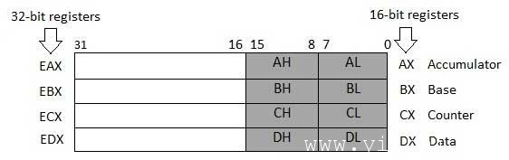
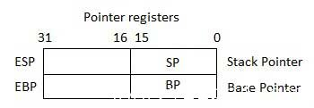
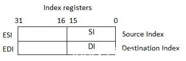

# Assembly 寄存器 - Assembly汇编

处理器操作主要涉及数据处理。这些数据可以被存储在存储器中，并从在其上进行访问。然而，读取数据和将数据存储到存储器的速度变慢的处理器，因为它涉及复杂的过程，整个控制总线发送的数据请求，到存储器的存储单元，并通过同一个通道获取数据。

为了加快该处理器，该处理器包括一些内部存储器中的存储位置，称为寄存器。

寄存器存储数据元素进行处理，而无需直接访问存储器。处理器芯片内置到数量有限的寄存器。

## 处理器寄存器

IA-32架构中有10个32位和6个16位处理器寄存器。该寄存器被分成三大类：

*   通用寄存器

*   控制寄存器

*   段寄存器

通用寄存器进一步分为以下几类：

*   数据寄存器

*   指针寄存器

*   索引寄存器

## 数据寄存器

4个32位数据寄存器用于算术，逻辑和其他操作。这些32位的寄存器可以用来在三个方面：

1.  32位数据寄存器: EAX, EBX, ECX, EDX.

2.  下半部分32位寄存器，可以作为4个16位数据寄存器: AX, BX, CX and DX.

3.  8个8位数据寄存器可以用作上面提到的4个16位寄存器的较低和较高的半部 AH, AL, BH, BL, CH, CL, DH, and DL.



这些数据寄存器中的某些具有特定的算术运算中使用。

**AX是主要累加器**; 它被用在输入/输出和多数算术运算指令。例如，在乘法运算中，一个操作数存储在EAX或AX或AL寄存器操作数的大小。

BX是已知的作为基址寄存器，因为它可以用在索引寻址。

CX称为计数寄存器ECX，CX寄存器存储中的循环计数迭代操作。

DX被称为数据寄存器。它也可以用来在输入/输出操作。它也可用于与AX寄存器连同DX涉及大的值的乘法和除法运算。

## 指针寄存器

指针寄存器是32位的EIP，ESP和EBP寄存器和相应的16位右部IP，SP和BP。指针寄存器有三类：

*   **Instruction Yiibaier (IP)** - 16位的IP寄存器存储的下一个要执行的指令的偏移地址。 IP与CS寄存器（CS：IP）给出了完整的代码段中的当前指令地址。

*   **Stack Yiibaier (SP)** - SP寄存器的16位提供程序堆栈内的偏移值。 SP与SS寄存器（SS：SP）是指在程序堆栈的当前位置的数据或地址。

*   **Base Yiibaier (BP)** - 在16-bit的BP寄存器主要是帮助在引用的参数变量传递到一个子程序。 SS寄存器中的地址相结合，在BP的偏移得到的参数的位置。 BP也可作为基址寄存器DI和SI结合特殊的寻址。



## 索引寄存器

32位变址寄存器ESI和EDI和16位的最右边的部分SI和DI用于索引寻址，有时用在加法和减法。有两组的索引指针：

*   **Source Index (SI)** - 它被用作来源分类索引为字符串操作

*   **Destination Index (DI)** -它被用来作为目标指数为字符串操作。



## 控制寄存器

32位指令指针寄存器和32位标志寄存器组合被视为控制寄存器。

许多指令涉及比较和数学计算和改变的状态标志，和其他一些有条件指令测试这些状态标志值到其他位置的控制流。

常见的标志位：

*   **Overflow Flag (OF)**: 指示符号的算术运算操作后的数据的高阶位（最左边的位）的溢出。

*   **Direction Flag (DF)**: 决定向左或向右移动或比较字符串数据的方向。当DF值是0，字符串的操作需要左到右的方向和当该值被设置为1时，该字符串的操作需要从右到左的方向。

*   **Interrupt Flag (IF)**: 决定是否外部中断。如，键盘输入等是被忽略或处理。它会禁用外部中断，当值为0时，设置为1时，允许中断。

*   **Trap Flag (TF)**: 可设置单步模式中的处理器的操作。我们使用调试程序设置陷阱标志，所以我们可以通过执行一个指令在一个时间步。

*   **Sign Flag (SF)**: 显示的符号的算术运算的结果。根据一个数据项的符号的算术运算后，这个标志被设置。最左边的位高阶符号表示。一个积极的结果清除SF值0和负结果，将其设置为1。

*   **Zero Flag (ZF)**: 指出算术运算或比较操作的结果。一个非零的结果清除零标志为0，结果为零，将其设置为1。

*   **Auxiliary Carry Flag (AF)**: 包含进从第3位到第4位算术运算，用于专门算术。 AF被设为1字节的算术操作导致进位从第3位到第4位。

*   **Parity Flag (PF)**: 在从一个算术运算的结果为1的位数表示的总数。为1的位数为偶数奇偶标志清零0，为1的位数为奇数个的奇偶校验设置标志位为1。

*   **Carry Flag (CF)**: 包含从高阶位（最左边的）算术运算后的进位为0或1。它还存储的内容的最后一个比特的移位或旋转操作。

下表显示在16位的标志寄存器的标志位的位置：

| Flag: | O | D | I | T | S | Z | A | P | C |
| --- | --- | --- | --- | --- | --- | --- | --- | --- | --- | --- | --- | --- | --- | --- | --- | --- |
| Bit no: | 15 | 14 | 13 | 12 | 11 | 10 | 9 | 8 | 7 | 6 | 5 | 4 | 3 | 2 | 1 | 0 |
| --- | --- | --- | --- | --- | --- | --- | --- | --- | --- | --- | --- | --- | --- | --- | --- | --- |

## 段寄存器

段含有数据，代码和堆栈在程序中定义的特定区域。有三个主要部分：

*   **代码段**:它包含了所有要执行的指令。一个16 - 位代码段寄存器CS寄存器存储的代码段的起始地址。

*   **数据段**: 它包含数据，常量和工作区。一个16 - 位数据段寄存器DS寄存器存储数据段的起始地址。

*   **堆栈段**: 它包含数据，程序或子程序的返回地址。它被实现为一个“堆栈”的数据结构。堆栈段寄存器或SS寄存器存储堆栈的起始地址。

除了在DS，CS和SS寄存器，还有其他的额外的段寄存器 - ES（附加段），FS和GS，它提供了用于存储数据的附加段。

在汇编语言编程，程序需要访问的内存位置。段内的所有的内存位置相对于该段的起始地址。在地址均匀分部开始禁用由16或10进制。因此，所有的在所有这样的存储器地址的最右边的十六进制数字是0，这是不一般存放在段寄存器。

段寄存器存储一个段的起始地址。为了得到确切的位置数据或指令段内的偏移值（或位移）是必需的。引用任何在一个段中的内存位置，所述处理器相结合的段寄存器中的段地址的偏移值的位置。

## 例子:

看看下面这个简单的程序，了解使用汇编编程寄存器。此程序显示在屏幕上的9颗星连同一个简单的信息：

```
section	.text
    global  _start	;must be declared for linker (gcc)
_start:	 ;tell linker entry yiibai
	mov	edx,len		;message length
	mov	ecx,msg		;message to write
	mov	ebx,1		;file descriptor (stdout)
	mov	eax,4		;system call number (sys_write)
	int	0x80		;call kernel

	mov	edx,9		;message length
	mov	ecx,s2		;message to write
	mov	ebx,1		;file descriptor (stdout)
	mov	eax,4		;system call number (sys_write)
	int	0x80	 	;call kernel
	mov	eax,1		;system call number (sys_exit)
	int	0x80		;call kernel

section	.data
msg db 'Displaying 9 stars',0xa ;a message
len equ $ - msg                 ;length of message
s2 times 9 db '*'
```

上面的代码编译和执行时，它会产生以下结果：

```
Displaying 9 stars
*********
```

 