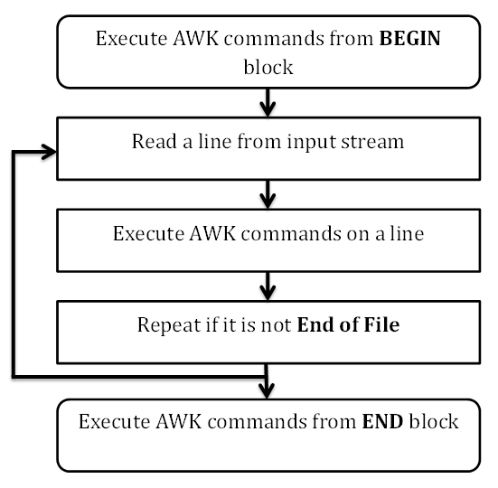

# AWK工作流程 - Awk教程

本章将介绍AWK究竟如何工作的。成为一个专家AWK程序员，需要知道它的内部流程。 AWK遵循一个简单的工作流程：读取，执行和重复。下图描述了工作流程。



### 读取

AWK从输入流(文件，管道，或标准输入)读取一行，并将其存储在存储器(内存)中。

### 执行

所有的AWK命令依次提交输入。默认情况下AWK执行命令每一行，但我们可以通过提供的模式限制。

### 重复

重复这个过程，直到该文件被处理完成。

## 程序结构

我们已经看到了AWK程序的工作流程。现在来了解AKW程序的结构。

### BEGIN 块

以下是BEGIN块语法：

```
BEGIN {awk-commands}
```

在BEGIN块被在程序启动时执行，且只执行一次。这是一个很好的初始化变量的地方。 BEGIN是AWK关键字，因此它必须是大写。请注意，这个块是可选的。

### Body块

以下是主体（Body）块的语法：

```
/pattern/ {awk-commands}
```

主体块适用于AWK的每个输入行命令。默认情况下AWK执行每一行命令，但可以通过提供的模式限制。请注意，没有主体块的关键字。

### END 块

以下是END块的语法：

```
END {awk-commands}
```

END块被在程序结束时执行。END是AWK关键字，因此它必须是大写。请注意，此块也是可选的。

### 示例

让创建一个包含序列号的学生，名字，科目并标记数量，文件的名称为：marks.txt。

```
1)    Amit     Physics    80
2)    Rahul    Maths      90
3)    Shyam    Biology    87
4)    Kedar    English    85
5)    Hari     History    89

```

现在用AWK脚本显示包含头文件的内容。

```
[jerry]$ awk 'BEGIN{printf "Sr No\tName\tSub\tMarks\n"} {print}' marks.txt
```

当执行上面的代码时，会产生以下结果。

```
Sr No Name     Sub        Marks
1)    Amit     Physics    80
2)    Rahul    Maths      90
3)    Shyam    Biology    87
4)    Kedar    English    85
5)    Hari     History    89

```

在程序启动时AWK从BEGIN块头打印。然后，在主体块时，它从一个文件读取一行，并执行打印标准输出流的内容，使用AWK的printf命令。这个过程不断重复，直到文件被耗尽。

 