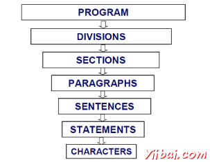

# COBOL程序结构 - COBOL教程

COBOL程序结构包括如在下面的图片显示：



简单介绍这些分区如下：

*   **Sections** 是程序逻辑的逻辑细分。段是段落的集合。
*   **Paragraphs** 是分区的一段或分立。它可以是用户自定义或预定义的名称后面加上的一段，由零个或多个句子/项。
*   **Sentences** 是一个或多个语句的组合。句子只出现在程序师。句子，必须结束有一个时期。
*   **Statements** 其执行一些处理有意义的COBOL语句。
*   **Characters** 是最低的层次，不能再分。

您可以互相涉及的以下示例中的上述条件与COBOL程序：

```
PROCEDURE DIVISION.
A0000-FIRST-PARA SECTION.
FIRST-PARAGRAPH.
ACCEPT WS-ID            - Statement-1  -----|
MOVE '10' TO WS-ID      - Statement-2       |-- Sentence - 1
DISPLAY WS-ID           - Statement-3  -----|
.

```

## 区划

COBOL程序由4个区划组成

### 鉴定区划

这是每个COBOL程序的第一个也是唯一的强制性分工。编程器和编译器使用该分工鉴定程序。在此处程序唯一的ID是强制性的段落。程序ID指定的程序名称。程序名称可以由1〜30个字符组成。

```
IDENTIFICATION DIVISION.
PROGRAM-ID. HELLO.
PROCEDURE DIVISION.
DISPLAY 'Welcome to yiibai'.
STOP RUN.

```

JCL以上COBOL程序执行。

```
//SAMPLE JOB(TESTJCL,XXXXXX),CLASS=A,MSGCLASS=C
//STEP1 EXEC PGM=HELLO

```

当编译并执行上面的程序它会产生以下结果：

```
Welcome to Yiibai

```

### 环境分区

环境区划用于指定输入和输出文件的程序。它由两部分组成：

*   配置部分给出了关于在其上的程序被写入和执行的系统信息。它由两段：来源计算机：用于编译程序系统。

    目标计算机：用于执行程序系统。

*   输入 - 输出部分，用于指定关于在节目中要使用的文件的信息。它由两段：文件控制：给出的程序中使用的外部数据集的信息。

    IO控制：提供在程序中使用的文件的信息。

```
ENVIRONMENT DIVISION.
CONFIGURATION SECTION.
SOURCE-COMPUTER. XXX-ZOS.
OBJECT-COMPUTER. XXX-ZOS.
INPUT-OUTPUT SECTION.
FILE-CONTROL.
SELECT FILEN ASSIGN TO DDNAME
ORGANIZATION IS SEQUENTIAL.

```

### 数据分区

数据分区是用来定义在该程序中使用的变量。它包括四个部分：

*   文件部分是用来定义文件的记录结构。
*   工作 - 存储部分被用于声明在程序中使用临时变量和文件结构。
*   本地存储部分与工作- 存储部分是一样的。唯一的区别是，变量将被分配并初始化每个程序开始执行时间。
*   连接段是用来形容那些从外部程序接收到的数据的名称。

COBOL程序

```
IDENTIFICATION DIVISION.
PROGRAM-ID. HELLO.
ENVIRONMENT DIVISION.
INPUT-OUTPUT SECTION.
FILE-CONTROL.
SELECT FILEN ASSIGN TO INPUT.
       ORGANIZATION IS SEQUENTIAL.
       ACCESS IS SEQUENTIAL.
DATA DIVISION.
FILE SECTION.
FD FILEN
01 NAME PIC A(25).
WORKING-STORAGE SECTION.
01 WS-STUDENT PIC A(30).
01 WS-ID PIC 9(5).
LOCAL-STORAGE SECTION.
01 LS-CLASS PIC 9(3).
LINKAGE SECTION.
01 LS-ID PIC 9(5).
PROCEDURE DIVISION.
DISPLAY 'Executing COBOL program using JCL'.
STOP RUN.

```

JCL以上COBOL程序执行。

```
//SAMPLE JOB(TESTJCL,XXXXXX),CLASS=A,MSGCLASS=C
//STEP1 EXEC PGM=HELLO
//INPUT DD DSN=ABC.EFG.XYZ,DISP=SHR

```

当编译并执行上面的程序它会产生以下结果：

```
Executing COBOL program using JCL

```

### 程序区划

程序分部被用于包含程序的逻辑。它包括使用数据分割定义的变量可执行语句。在这个划分，段落和章节名称是user-defined。

必须有程序师至少有一个语句。最后语句结束在执行这种划分或者是停止运行它用于调用它采用的是被称为程序的程序或退出程序。

```
IDENTIFICATION DIVISION.
PROGRAM-ID. HELLO.
DATA DIVISION.
WORKING-STORAGE SECTION.
01 WS-NAME PIC A(30).
01 WS-ID PIC 9(5) VALUE '12345'.
PROCEDURE DIVISION.
A000-FIRST-PARA.
DISPLAY 'Hello World'.
MOVE 'YiiBai' TO WS-NAME.
DISPLAY "My name is : "WS-NAME.
DISPLAY "My ID is : "WS-ID.
STOP RUN.

```

JCL以上COBOL程序执行。

```
//SAMPLE JOB(TESTJCL,XXXXXX),CLASS=A,MSGCLASS=C
//STEP1 EXEC PGM=HELLO

```

当编译并执行上面的程序它会产生以下结果：

```
Hello World
My name is : YiiBai
My ID is : 12345
```

 