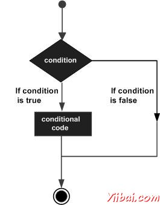

# D语言决策语句 - D语言教程

决策结构需要程序员指定一个或多个条件由程序进行评估或测试，以及要执行的语句或语句如果条件被确定为true，并选择，要执行其他语句如果条件被确定为false。

下面是在大多数编程语言中一个典型的决策结构的一般形式为：



D编程语言假设任何非零和非空值作为true，如果是零或null，则假定为false。

D编程语言提供了以下类型的决策列表。点击以下链接，查看其详细信息。

| 语句 | 描述 |
| --- | --- |
| [if语句](http://www.yiibai.com/d_programming/d_programming_if_statement.html "if statement in D") | if语句由一个布尔表达式后跟一个或多个语句。 |
| [if...else语句](http://www.yiibai.com/d_programming/d_programming_if_else_statement.html "if...else statement in D") | 一个if语句后面可以跟一个可选的else语句，该语句执行时的布尔表达式为false。 |
| [嵌套if语句](http://www.yiibai.com/d_programming/d_programming_nested_if_statements.html "nested if statements in D") | 可以使用一个if或else if语句在另一个if或else if语句。 |
| [switch语句](http://www.yiibai.com/d_programming/d_programming_switch_statement.html "switch statement in D") | switch语句允许一个变量来对值的列表平等进行测试。 |
| [嵌套switch语句](http://www.yiibai.com/d_programming/d_programming_nested_switch_statements.html "nested switch statements in D") | 可以使用一个switch语句在另一个switch语句。 |

## ? : 操作符:

我们已经覆盖条件运算符？ ：在前面的章节中，可以用来代替if...else 语句。它具有如下一般形式：

```
Exp1 ? Exp2 : Exp3;
```

当Exp1, Exp2, 和Exp3是一个表达式。注意到冒号使用和放置。

a值 ? 表达这样的决定: Exp1 被计算， 如果为true, 那么Exp2 被评估，并且变成整个的值。 ? 表达式. 如果Exp1 为false, 那么 Exp3 被评估，并将其值变成表达式的值。

 