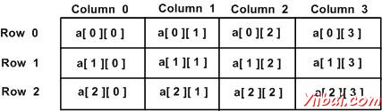

# D语言数组 - D语言教程

D编程语言提供了一种数据结构，数组用于存储相同类型的元素的一个固定大小的连续集合。数组是用于存储数据的集合，但它往往认为阵列为相同类型的变量的集合。

相反声明个别变数，如number0, number1, ..., 和number99，声明一个数组变量，如使用数字numbers[0], numbers[1], 和..., numbers[99]来表示各个变量。在数组中的特定元素是通过索引来访问。

所有阵列组成的连续的存储单元。最低的地址对应于所述第一元素，而最高地址的最后一个元素。

## 声明数组：

在D编程语言声明数组，程序员指定的元素和如下由阵列所需元素的数量的类型：

```
type arrayName [ arraySize ];
```

这就是所谓的单维数组。arraySize必须是整数常量大于零且类型可以是任何有效的D编程语言数据类型。例如，要声明一个10个元素的数组为double类型，使用此语句：

```
double balance[10];
```

## 初始化数组：

可以初始化D编程语言的数组元素或者一个接一个，或使用一个单独的语句如下：

```
double balance[5] = [1000.0, 2.0, 3.4, 17.0, 50.0];
```

方括号内[]的值的个数在右边不能比，我们的声明方括号[]之间的数组元素的个数较大。下面是一个示例来指定数组的单个元素：

如果省略数组的大小，创建数组的大小刚好能容纳初始化。因此，如果编写：

```
double balance[] = [1000.0, 2.0, 3.4, 17.0, 50.0];
```

将创建完全相同的数组，和在前面的例子中那样。

```
balance[4] = 50.0;
```

上述声明数组的值50.0在指定元素数第5位。与第四索引数组将是第五次，即最后一个元素，因为所有的数组都是让 0作为他们的第一个元素，也被称为基本索引的索引。以下是我们上面讨论的相同阵列的图案表现出来：


## 访问数组元素：

元素是由索引数组名访问。这是通过将一个元素的索引数组的名称之后方括号内进行。例如：

```
double salary = balance[9];
```

上面的语句将第10元素从数组并赋值给变量salary。下面是一个例子，这将使用所有上述三个概念即：声明，赋值和访问数组：

```
import std.stdio;

void main()
{
   int n[ 10 ]; // n is an array of 10 integers

   // initialize elements of array n to 0
   for ( int i = 0; i < 10; i++ )
   {
      n[ i ] = i + 100; // set element at location i to i + 100
   }

   writeln("Element 	 Value");

   // output each array element's value
   for ( int j = 0; j < 10; j++ )
   {
      writeln(j," 	 ",n[j]);
   }
}
```

让我们编译和运行上面的程序，这将产生以下结果：

```
Element 	 Value
0 		  100
1 		  101
2 		  102
3 		  103
4 		  104
5 		  105
6 		  106
7 		  107
8 		  108
9 		  109

```

## 静态数组与动态数组

当在程序被写入所指定的数组的长度，该阵列是一个静态数组。当长度可以在程序的执行过程中发生变化，该阵列是一个动态数组。

定义动态数组不是定义固定长度的阵列，因为省略长度使得一个动态数组简单：

```
int[] dynamicArray;
```

## 数组属性

| 属性 | 描述 |
| --- | --- |
| .init | 静态数组返回一个数组字面量的字面即数组元素类型。初始化属性中的每个元素。 |
| .sizeof | 静态数组返回数组的长度乘以每个数组元素的字节数，而动态数组返回动态数组的引用，在32位版本大小为8，在64位版本的大小为16。 |
| .length | 静态数组返回，而动态数组是用来获取/设置数组中的元素个数数组中元素的个数。长度的类型为size_t。 |
| .ptr | 返回一个指向数组的第一个元素。 |
| .dup | 创建同样大小的动态数组及数组中的内容复制到其中。 |
| .idup | 创建同样大小的动态数组及数组中的内容复制到其中。该副本的类型为是不可变的。 |
| .reverse | 在当前位置倒转数组中的元素的顺序。返回数组。 |
| .sort | 在这里各种阵列中的元素的顺序。返回数组。 |

下面的例子说明可用于数组的各种属性。

```
import std.stdio;

void main()
{
   int n[ 5 ]; // n is an array of 5 integers

   // initialize elements of array n to 0
   for ( int i = 0; i < 5; i++ )
   {
      n[ i ] = i + 100; // set element at location i to i + 100
   }
   writeln("Initialized value:",n.init);

   writeln("Length: ",n.length);
   writeln("Size of: ",n.sizeof);
   writeln("Yiibaier:",n.ptr);

   writeln("Duplicate Array: ",n.dup);
   writeln("iDuplicate Array: ",n.idup);

   n = n.reverse.dup;
   writeln("Reversed Array: ",n);

   writeln("Sorted Array: ",n.sort);
}
```

让我们编译和运行上面的程序，这将产生以下结果：

```
Initialized value:[0, 0, 0, 0, 0]
Length: 5
Size of: 20
Yiibaier:7FFF5A373920
Duplicate Array: [100, 101, 102, 103, 104]
iDuplicate Array: [100, 101, 102, 103, 104]
Reversed Array: [104, 103, 102, 101, 100]
Sorted Array: [100, 101, 102, 103, 104]

```

## 多维数组

D编程允许多维数组。这里是一个多维数组声明的一般形式为：

```
type name[size1][size2]...[sizeN];
```

例如，下面的声明创建一个三维： 5 . 10 . 4整数数组：

```
int threedim[5][10][4];
```

## 二维数组：

多维数组的最简单的形式是二维阵列。二维阵列在本质上是一维阵列的列表。声明大小为x,y的二维整型数组，编写如下：

```
type arrayName [ x ][ y ];
```

其中type可以是任何有效的D编程的数据类型和arrayName中会是一个有效的D编程标识符。

一个二维数组可以想作是一个表，有行和列：x行y列的数量，它包含三行四列可以如下所示：



因此，在数组每个元素是确定的形式的元素名为[i][j]时，其中a是数组的名称，并且i和j是用来唯一地标识每一个元素的下标。

## 初始化二维数组：

多维阵列可以通过指定每一行括号内的值进行初始化。以下是3行，每行一个数组有4列。

```
int a[3][4] = [  
 [0, 1, 2, 3] ,   /*  initializers for row indexed by 0 */
 [4, 5, 6, 7] ,   /*  initializers for row indexed by 1 */
 [8, 9, 10, 11]   /*  initializers for row indexed by 2 */
];
```

嵌套的括号，这表明预定的行，是可选的。下面的初始化等同于前面的例子：

```
int a[3][4] = [0,1,2,3,4,5,6,7,8,9,10,11];
```

## 访问二维数组元素：

在2维数组的元素是通过使用下标，即行索引和所述阵列的列索引的访问。例如：

```
int val = a[2][3];
```

上面的语句将第4个元素的数组的第三排。可以在上面双字母组合验证。

```
import std.stdio;

void main ()
{
   // an array with 5 rows and 2 columns.
   int a[5][2] = [ [0,0], [1,2], [2,4], [3,6],[4,8]];

   // output each array element's value                      
   for ( int i = 0; i < 5; i++ )
      for ( int j = 0; j < 2; j++ )
      {
         writeln( "a[" , i , "][" , j , "]: ",a[i][j]);
      } 
}
```

让我们编译和运行上面的程序，这将产生以下结果：

```
a[0][0]: 0
a[0][1]: 0
a[1][0]: 1
a[1][1]: 2
a[2][0]: 2
a[2][1]: 4
a[3][0]: 3
a[3][1]: 6
a[4][0]: 4
a[4][1]: 8

```

## 常见的数组操作

### 数组分片

我们经常用一个数组的一部分，切片阵列往往是相当有用的。一个简单的例子数组切片如下所示。

```
import std.stdio;

void main ()
{
   // an array with 5 elements.
   double a[5] = [1000.0, 2.0, 3.4, 17.0, 50.0];
   double[] b;

   b = a[1..3];
   writeln(b);
}
```

让我们编译和运行上面的程序，这将产生以下结果：

```
[2, 3.4]

```

### 数组复制

我们还使用复制数组。一个简单的例子，适用于阵列的复制如下所示。

```
import std.stdio;

void main ()
{
   // an array with 5 elements.
   double a[5] = [1000.0, 2.0, 3.4, 17.0, 50.0];
   double b[5];
   writeln("Array a:",a);
   writeln("Array b:",b);

   b[] = a;      // the 5 elements of a[5] are copied into b[5]
   writeln("Array b:",b);

   b[] = a[];   // the 5 elements of a[3] are copied into b[5]
   writeln("Array b:",b);

   b[1..2] = a[0..1]; // same as b[1] = a[0]
   writeln("Array b:",b);

   b[0..2] = a[1..3]; // same as b[0] = a[1], b[1] = a[2]
   writeln("Array b:",b);
}
```

让我们编译和运行上面的程序，这将产生以下结果：

```
Array a:[1000, 2, 3.4, 17, 50]
Array b:[nan, nan, nan, nan, nan]
Array b:[1000, 2, 3.4, 17, 50]
Array b:[1000, 2, 3.4, 17, 50]
Array b:[1000, 1000, 3.4, 17, 50]
Array b:[2, 3.4, 3.4, 17, 50]

```

### 数组设定

一个简单的例子数组中的设定值如下所示。

```
import std.stdio;

void main ()
{
   // an array with 5 elements.
   double a[5];
   a[] = 5;
   writeln("Array a:",a);
}

```

当上面的代码被编译并执行，它会产生以下结果：

```
Array a:[5, 5, 5, 5, 5]

```

### 数组连接

一个简单的例子对两个数组的并置如下所示。

```
import std.stdio;

void main ()
{
   // an array with 5 elements.
   double a[5] = 5;
   double b[5] = 10;
   double [] c;
   c = a~b;
   writeln("Array c: ",c);
}

```

让我们编译和运行上面的程序，这将产生以下结果：

```
Array c: [5, 5, 5, 5, 5, 10, 10, 10, 10, 10]
```

 