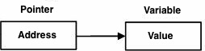

# D语言指针 - D语言教程

D编程指针是很容易和有趣学习。一些D编程任务的指针进行更容易和其他D编程任务，如动态存储器分配，不能没有它们来执行。一个简单的指针如下所示。



而不是直接指向变量一样，指针所指向的值赋给变量的地址。正如你所知道的每个变量是一个内存位置和每个存储单元都有其定义的地址，可以使用符号来访问(＆)运算，是指在存储器中的地址。认为这将打印中定义的变量的地址如下：

```
import std.stdio;

void main ()
{
   int  var1;
   writeln("Address of var1 variable: ",&var1);

   char var2[10];
   writeln("Address of var2 variable: ",&var2);
}

```

当上面的代码被编译并执行，它会产生什么结果如下：

```
Address of var1 variable: 7FFF52691928
Address of var2 variable: 7FFF52691930

```

## 什么是指针？

指针是一个变量，它的值是另一个变量的地址。如同任何变量或常量，必须声明一个指针，然后才能使用它。一个指针变量声明的一般形式是：

```
type *var-name;
```

其中，type是指针的基本类型;它必须是一个有效的编程类型和var-name是指针变量的名称。用来声明一个指针的星号是用于乘法相同的星号。然而，在这个语句中的星号是被用来指定一个变量的指针。以下是有效的指针声明：

```
int    *ip;    // yiibaier to an integer
double *dp;    // yiibaier to a double
float  *fp;    // yiibaier to a float
char   *ch     // yiibaier to character
```

所有指针的值的实际数据类型，整数，浮点数，字符，或以其他方式是否是相同的，代表一个内存地址的十六进制数。不同数据类型的指针之间的唯一区别是变量或常数，该指针指向的数据类型。

## D编程语言使用指针：

有几个重要的业务，我们将与指针做的非常频繁。 (a)我们定义一个指针变量(b)分配一个变量的地址的指针(c)在指针变量中可用的地址最终进入的值。这是通过使用一元运算符*，返回位于其操作数指定的地址变量的值来完成。下面的示例使用这些操作：

```
import std.stdio;

void main ()
{
   int  var = 20;   // actual variable declaration.
   int  *ip;        // yiibaier variable

   ip = &var;       // store address of var in yiibaier variable

   writeln("Value of var variable: ",var);

   writeln("Address stored in ip variable: ",ip);

   writeln("Value of *ip variable: ",*ip);
}
```

当上面的代码被编译并执行，它会产生什么结果如下：

```
Value of var variable: 20
Address stored in ip variable: 7FFF5FB7E930
Value of *ip variable: 20
```

## Null 指针

它始终是一个好习惯，对NULL指针分配给案件的指针变量你没有确切的地址进行分配。这样做是在变量声明的时候。分配空指针被称为空指针(null)。

空指针是一个常数为零的几个标准库，包括iostream中定义的值。考虑下面的程序：

```
import std.stdio;

void main ()
{
   int  *ptr = null;
   writeln("The value of ptr is " , ptr) ; 
}
```

让我们编译和运行上面的程序，这将产生以下结果：

```
The value of ptr is null
```

在大多数的操作系统，程序不允许在地址0访问内存，因为内存是​​由操作系统保留。然而，存储器地址0具有特殊的意义;它表明，该指针不旨在指向一个可访问的存储器位置。但按照惯例，如果一个指针包含空（零）值，它被假定为不指向什么东西。

要检查空指针，可以使用一个if语句如下：

```
if(ptr)     // succeeds if p is not null
if(!ptr)    // succeeds if p is null
```

因此，如果所有未使用的指针被赋予空值，并且避免使用空指针，能避免未初始化的指针的意外误操作。很多时候，未初始化的变量举行一些垃圾值，就很难调试程序。

## 指针运算

可以对指针的使用加减乘除四则运算符： ++, --, +, -

为了理解指针的算术运算，让我们认为，ptr是一个整数的指针，假设它32位指向的地址1000整数，让我们上的指针执行以下算术运算：

```
ptr++
```

ptr将指向位置1004，因为每次ptr递增，它会指向下一个整数。此操作将指针移动到下一个内存位置，而不在内存中的位置影响实际值。如果ptr指向一个字符的地址是1000，那么上面的操作将指向位置1001，因为下一个字符将在1001。

## 递增一个指针：

我们优选使用在我们的程序，而不是一个数组的指针，因为变量指针可以递增，这是不能被增加，因为它是一个常量指针数组名不同。下面的程序将变量指针来访问数组中的每个元素成功：

```
import std.stdio;

const int MAX = 3;

void main ()
{
   int  var[MAX] = [10, 100, 200];
   int  *ptr = &var[0];

   for (int i = 0; i < MAX; i++, ptr++)
   {
      writeln("Address of var[" , i , "] = ",ptr);
      writeln("Value of var[" , i , "] = ",*ptr);
   }
}
```

当上面的代码被编译并执行，它会产生一些结果如下：

```
Address of var[0] = 18FDBC
Value of var[0] = 10
Address of var[1] = 18FDC0
Value of var[1] = 100
Address of var[2] = 18FDC4
Value of var[2] = 200
```

## 指针与数组

指针和数组有很大的关系。然而，指针和数组不完全互换。例如，考虑下面的程序：

```
import std.stdio;

const int MAX = 3;

void main ()
{
   int  var[MAX] = [10, 100, 200];
   int  *ptr = &var[0];
   var.ptr[2]  = 290;
   ptr[0] = 220;

   for (int i = 0; i < MAX; i++, ptr++)
   {
      writeln("Address of var[" , i , "] = ",ptr);
      writeln("Value of var[" , i , "] = ",*ptr);
   }
}
```

在上面的程序中，可以看到var.ptr[2]来设置第二个元素和ptr[0]这是用来设置第零个元素。递增运算符可以使用ptr但不使用var。

当上面的代码被编译并执行，它会产生一些结果如下：

```
Address of var[0] = 18FDBC
Value of var[0] = 220
Address of var[1] = 18FDC0
Value of var[1] = 100
Address of var[2] = 18FDC4
Value of var[2] = 290
```

## 指针的指针

一个指针，指针是多个间接或链指针的一种形式。通常情况下，一个指针包含一个变量的地址。当我们定义一个指向指针的指针，第一指针包含第二指针，它指向包含实际值如下所示的位置的地址。


一个变量，它是一个指向指针的指针必须被声明为此类。这是通过把一个附加星号在其名称前完成。例如，以下是声明来声明一个指向int类型的指针：

```
int **var;
```

当目标值被间接地通过一个指向指针指向的，访问该值要求的星号运算符被应用两次，如下面的例子所示：

```
import std.stdio;

const int MAX = 3;

void main ()
{
   int  var = 3000;
   writeln("Value of var :" , var);

   int  *ptr = &var;
   writeln("Value available at *ptr :" ,*ptr);

   int  **pptr = &ptr;
   writeln("Value available at **pptr :",**pptr);
}
```

让我们编译和运行上面的程序，这将产生以下结果：

```
Value of var :3000
Value available at *ptr :3000
Value available at **pptr :3000
```

## 指针传递给函数

D编程允许将一个指针传递给一个函数。要做到这一点，只需声明该函数的参数为指针类型。

下面一个简单的例子，我们传递一个指向函数的指针。

```
import std.stdio;

void main ()
{
   // an int array with 5 elements.
   int balance[5] = [1000, 2, 3, 17, 50];
   double avg;

   avg = getAverage( &balance[0], 5 ) ;
   writeln("Average is :" , avg);
}

double getAverage(int *arr, int size)
{
   int    i;
   double avg, sum = 0;

   for (i = 0; i < size; ++i)
   {
      sum += arr[i];
   }

   avg = sum/size;
   return avg;
}
```

当上面的代码一起编译和执行时，它会产生下列结果：

```
Average is :214.4
```

## 返回指针的函数

考虑下面的函数，它将使用第一个数组元素的指针，即，地址返回数字10。

```
import std.stdio;

void main ()
{
   int *p = getNumber();
   for ( int i = 0; i < 10; i++ )
   {
      writeln("*(p + " , i , ") : ",*(p + i));
   }
}

int * getNumber( )
{
   static int  r [10];
   for (int i = 0; i < 10; ++i)
   {
      r[i] = i;
   }
   return &r[0];
}
```

当上面的代码一起编译并执行，它会产生一些结果如下：

```
*(p + 0) : 0
*(p + 1) : 1
*(p + 2) : 2
*(p + 3) : 3
*(p + 4) : 4
*(p + 5) : 5
*(p + 6) : 6
*(p + 7) : 7
*(p + 8) : 8
*(p + 9) : 9
```

## 指向数组的指针

数组名是一个常量指针数组的第一个元素。因此，声明：

```
double balance[50];
```

balance是一个指针，指向与balance[0]，这是阵列平衡的第一个元素的地址。因此，下面的程序片段分配p为balance的第一个元素的地址：

```
double *p;
double balance[10];

p = balance;
```

它是合法的，使用数组名作为常量指针，反之亦然。因此，*(balance + 4) 处于访问balance[4]数据的一种合法方法。

一旦存储p中第一个元素的地址，可以使用* p*（p +1），*（p+2）等访问数组元素。下面是该例子，以显示所有上面讨论的概念：

```
import std.stdio;

void main ()
{
   // an array with 5 elements.
   double balance[5] = [1000.0, 2.0, 3.4, 17.0, 50.0];
   double *p;

   p = &balance[0];

   // output each array element's value 
   writeln("Array values using yiibaier " ); 

   for ( int i = 0; i < 5; i++ )
   {
      writeln( "*(p + ", i, ") : ", *(p + i));
   }
}
```

让我们编译和运行上面的程序，这将产生以下结果：

```
Array values using yiibaier 
*(p + 0) : 1000
*(p + 1) : 2
*(p + 2) : 3.4
*(p + 3) : 17
*(p + 4) : 50
```

 