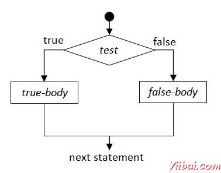

# Euphoria分支语句 - Euphoria教程

分支是最重要的方面，任何编程语言。在编写程序时可能会遇到的情况时，必须作出决定或者有许多选项中选择一个选项。

下图显示了一个简单的场景，一个程序可能采取基于给定条件的两条路径之一。

Euphoria 提供了以下三种类型的决策（分支或有条件）语句：

1.  [if 语句](http://www.yiibai.com/euphoria/euphoria_if_statement.html "if statement")

2.  [switch 语句](http://www.yiibai.com/euphoria/euphoria_switch_statement.html "switch statement")

3.  [ifdef 语句](http://www.yiibai.com/euphoria/euphoria_ifdef_statement.html "ifdef statement")

所有上述陈述有各种各样的形式，为您提供的灵活性和易用性，根据不同的情况。

