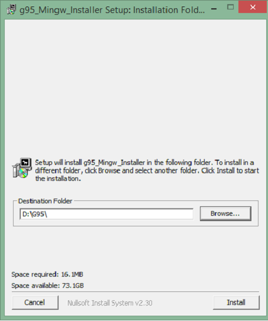
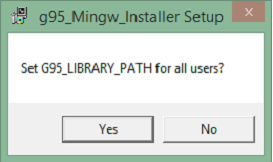

# Fortran语言环境设置 - Fortran教程

## 在Windows上设置Fortran语言环境

G95是GNU Fortran语言多架构的编译器，用于建立Fortran语言在Windows中。 Windows版本的模拟使用MingW平台下的Windows UNIX环境。安装完成这个功能，并自动添加G95到Windows PATH变量。

可以从G95的稳定版这里得到：



## 如何使用G95

在安装过程中，G95会自动添加到PATH变量中，如果选择“RECOMMENDED”选项。这意味着，可以简单地打开一个新的命令提示符窗口，输入“G95”，弹出的编译器。找到一些基本的命令，我们现在就开始吧。

| 命令 | 描述 |
| --- | --- |
| g95 –c hello.f90 | 编译hello.f 90到目标文件命名为hello.o |
| g95 hello.f90 | 编译hello.f 90并链接到生成可执行的a.out 文件 |
| g95 -c h1.f90 h2.f90 h3.f90 | 编译多个源文件。如果一切顺利的话，目标文件h1.o，h2.o和h3.o创建 |
| g95 -o hello h1.f90 h2.f90 h3.f90 | 编译多个源文件并将它们链接在一起，命名为'hello'的可执行文件 |

**G95的命令行选项：**

```
-c Compile only, do not run the linker.
-o Specify the name of the output file, either an object file or the executable.

```

多个源文件和目标文件可以一次指定。 Fortran文件由名称".f", ".F", ".for", ".FOR", ".f90", ".F90", ".f95", ".F95", ".f03" and ".F03".“。对于”结尾表示多个源文件可以被指定。目标文件可以被指定为良好，将被链接以形成一个可执行文件。

 