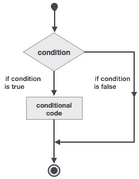

# Fortran选择决策 - Fortran教程

决策结构需要程序员指定的一个或多个条件进行评估计算或由程序进行测试，如果该条件被确定为真，则一条或多条语句将被执行，如果要被执行的其它语句条件被确定为假的则选择其它语句块。

以下是在大多数编程语言中的一个典型的决策结构的一般形式：

Fortran提供决策构建以下类型。

| 语句 | 描述 |
| --- | --- |
| [If… then 结构](http://www.yiibai.com/fortran/if_then_construct.html) | **if… then… end if** 语句由一个逻辑表达式后跟一个或多个语句。 |
| [If… then...else 结构](http://www.yiibai.com/fortran/if_then_else_construct.html) | **if… then**语句可以后跟一个可选的 **else statement,** 它执行时，逻辑表达式为假。 |
| [if...else if...else 结构](http://www.yiibai.com/fortran/if_elseif_else_construct.html) | **if** 语句构建体可具有一个或多个可选的 **else-if** 结构。当 **if** 条件不满足，则紧跟 **else-if** 执行。当 **else-if** 还失败，其继续 **else-if** 语句（如果有的话）被执行，依此类推。 |
| [内嵌 if 结构](http://www.yiibai.com/fortran/nested_if_construct.html) | 可以使用一个 **if** 或 **else if** 语句在另外一个 **if** 或 **else if** 语句内部 |
| [select case 语句](http://www.yiibai.com/fortran/select_case_construct.html) | Select Case语句允许一个变量的值对的列表，平等进行测试。 |
| [内嵌select case 结构](http://www.yiibai.com/fortran/nested_select_case_construct.html) | 可以使用一个SELECT CASE语句中的另一个选择case语句。 |

 