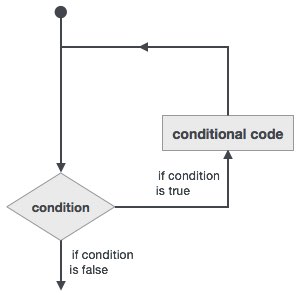

# Fortran循环 - Fortran教程

可能有一种情况，当需要执行代码块多数。在一般情况下，语句顺序执行：在一个函数的第一条语句，首先执行，然后是第二个。。。等等。

编程语言提供了多种控制结构，使更复杂的执行路径。

循环语句允许我们执行语句的语句多次或组，然后下面是在大多数的编程语言中的循环语句的一般形式为：

Fortran语言提供了循环结构的以下类型的循环处理的要求。点击以下链接，查看其详细信息。

| 循环类型 | 描述 |
| --- | --- |
| [do循环](http://www.yiibai.com/fortran/fortran_do_loop.html) | 该构建体使得语句或一系列语句迭代进行，当一个给定的条件为真。 |
| [do while循环](http://www.yiibai.com/fortran/fortran_do_while_loop.html) | 重复声明语句或一组，当给定的条件为真。它测试的条件执行循环体之前。 |
| [内嵌循环](http://www.yiibai.com/fortran/fortran_nested_loop.html) | 可以使用一个或多个循环结构在其他循环结构里面。 |

## 循环控制语句

循环控制语句改变其正常的顺序执行。当执行离开循环范围，在该范围内创建的所有对象自动销毁。

Fortran语言支持以下控制语句。点击以下链接，查看其详细信息。

| 控制语句 | 描述 |
| --- | --- |
| [exit](http://www.yiibai.com/fortran/fortran_exit.html) | 如果被执行exit语句则会退出该循环，并且该程序的继续执行第一个可执行语句结束之后的语句执行。 |
| [cycle](http://www.yiibai.com/fortran/fortran_cycle.html) | 如果执行了一个循环语句，则程序继续到下一次迭代的起始位置。 |
| [stop](http://www.yiibai.com/fortran/fortran_stop.html) | 如果想执行的程序停止，可以插入声明一个stop语句 |

 