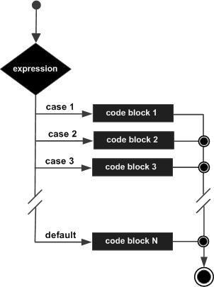

# Go 语言 switch 语句


switch 语句用于基于不同条件执行不同动作，每一个 case 分支都是唯一的，从上直下逐一测试，直到匹配为止。。

switch 语句执行的过程从上至下，直到找到匹配项，匹配项后面也不需要再加break

### 语法

Go 编程语言中 switch 语句的语法如下：

```
switch var1 {
    case val1:
        ...
    case val2:
        ...
    default:
        ...
}
```

变量 var1 可以是任何类型，而 val1 和 val2 则可以是同类型的任意值。类型不被局限于常量或整数，但必须是相同的类型；或者最终结果为相同类型的表达式。

您可以同时测试多个可能符合条件的值，使用逗号分割它们，例如：case val1, val2, val3。

流程图：



### 实例

```
package main

import "fmt"

func main() {
   /* 定义局部变量 */
   var grade string = "B"
   var marks int = 90

   switch marks {
      case 90: grade = "A"
      case 80: grade = "B"
      case 50,60,70 : grade = "C"
      default: grade = "D"  
   }

   switch {
      case grade == "A" :
         fmt.Printf("优秀!\n" )     
      case grade == "B", grade == "C" :
         fmt.Printf("良好\n" )      
      case grade == "D" :
         fmt.Printf("及格\n" )      
      case grade == "F":
         fmt.Printf("不及格\n" )
      default:
         fmt.Printf("差\n" );
   }
   fmt.Printf("你的等级是 %s\n", grade );      
}
```

以上代码执行结果为：

```
优秀!  
你的等级是 A
```

## Type Switch

switch 语句还可以被用于 type-switch 来判断某个 interface 变量中实际存储的变量类型。

Type Switch 语法格式如下：

```
switch x.(type){
    case type:
       statement(s);      
    case type:
       statement(s); 
    /* 你可以定义任意个数的case */
    default: /* 可选 */
       statement(s);
}
```

### 实例

```
package main

import "fmt"

func main() {
   var x interface{}
     
   switch i := x.(type) {
      case nil:	  
         fmt.Printf(" x 的类型 :%T",i)                
      case int:	  
         fmt.Printf("x 是 int 型")                       
      case float64:
         fmt.Printf("x 是 float64 型")           
      case func(int) float64:
         fmt.Printf("x 是 func(int) 型")                      
      case bool, string:
         fmt.Printf("x 是 bool 或 string 型" )       
      default:
         fmt.Printf("未知型")     
   }   
}
```

以上代码执行结果为：

```
x 的类型  :<nil>
```


