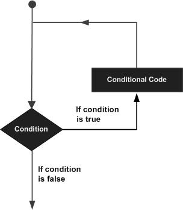

# Go 语言循环语句

在不少实际问题中有许多具有规律性的重复操作，因此在程序中就需要重复执行某些语句。

以下为大多编程语言循环程序的流程图： 

Go 语言提供了以下几种类型循环处理语句：

| 循环类型 | 描述 |
| --- | --- |
| [for 循环](go-for-loop.html) | 重复执行语句块 |
| [循环嵌套](/go/go-nested-loops.html) | 在 for 循环中嵌套一个或多个 for 循环 |

## 循环控制语句

循环控制语句可以控制循环体内语句的执行过程。

GO 语言支持以下几种循环控制语句：

| 控制语句 | 描述 |
| --- | --- |
| [break 语句](/go/go-break-statement.html) | 经常用于中断当前 for 循环或跳出 switch 语句 |
| [continue 语句](/go/go-continue-statement.html) | 跳过当前循环的剩余语句，然后继续进行下一轮循环。 |
| [goto 语句](/go/go-goto-statement.html) | 将控制转移到被标记的语句。 |

## 无限循环

如过循环中条件语句永远不为 false 则会进行无限循环，我们可以通过 for 循环语句中只设置一个条件表达式来执行无限循环：

```
package main

import "fmt"

func main() {
    for true  {
        fmt.Printf("这是无限循环。\n");
    }
}

```

