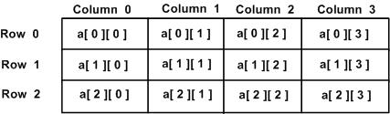

# Go 语言多维数组


Go 语言支持多维数组，以下为常用的多维数组声明方式：

```
var variable_name [SIZE1][SIZE2]...[SIZEN] variable_type
```

以下实例声明了三维的整型数组：

```
var threedim [5][10][4]int
```

## 二维数组

二维数组是最简单的多维数组，二维数组本质上是由一维数组组成的。二维数组定义方式如下：

```
var arrayName [ x ][ y ] variable_type
```

variable_type 为 Go 语言的数据类型，arrayName 为数组名，二维数组可认为是一个表格，x 为行，y 为列，下图演示了一个二维数组 a 为三行四列：



二维数组中的元素可通过 _a[ i ][ j ]_ 来访问。

## 初始化二维数组

多维数组可通过大括号来初始值。以下实例为一个 3 行 4 列的二维数组：

```
a = [3][4]int{  
 {0, 1, 2, 3} ,   /*  第一行索引为 0 */
 {4, 5, 6, 7} ,   /*  第二行索引为 1 */
 {8, 9, 10, 11}   /*  第三行索引为 2 */
}
```

## 访问二维数组

二维数组通过指定坐标来访问。如数组中的行索引与列索引，例如：

```
int val = a[2][3]
```

以上实例访问了二维数组 val 第三行的第四个元素。

二维数组可以使用循环嵌套来输出元素：

```
package main

import "fmt"

func main() {
   /* 数组 - 5 行 2 列*/
   var a = [5][2]int{ {0,0}, {1,2}, {2,4}, {3,6},{4,8}}
   var i, j int

   /* 输出数组元素 */
   for  i = 0; i < 5; i++ {
      for j = 0; j < 2; j++ {
         fmt.Printf("a[%d][%d] = %d\n", i,j, a[i][j] )
      }
   }
}
```

以上实例运行输出结果为：

```
a[0][0] = 0
a[0][1] = 0
a[1][0] = 1
a[1][1] = 2
a[2][0] = 2
a[2][1] = 4
a[3][0] = 3
a[3][1] = 6
a[4][0] = 4
a[4][1] = 8
```
