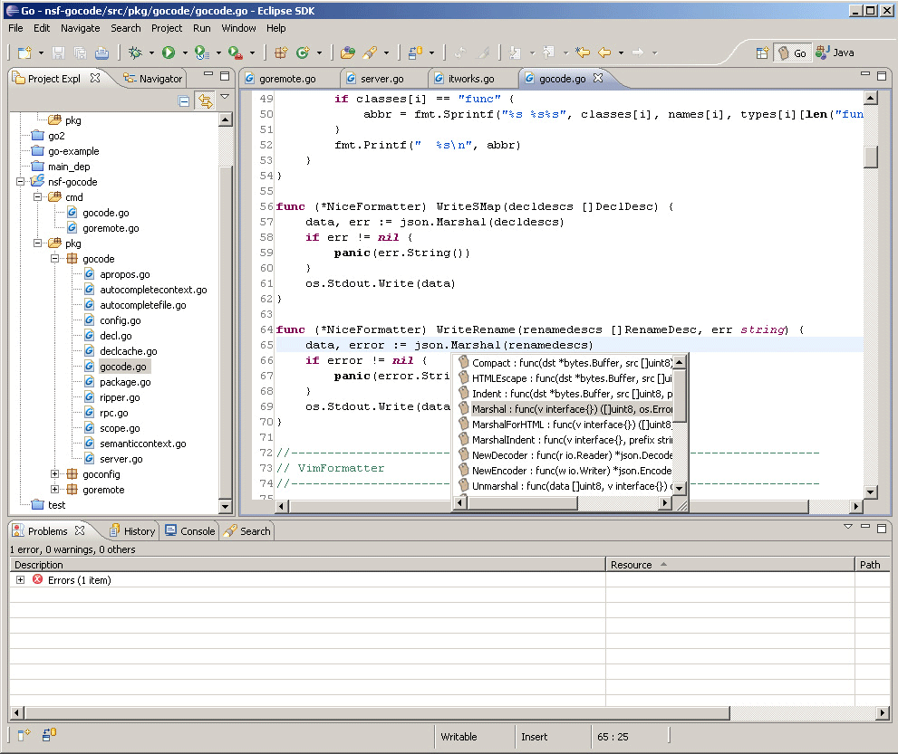
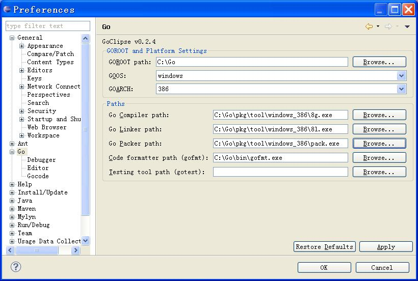
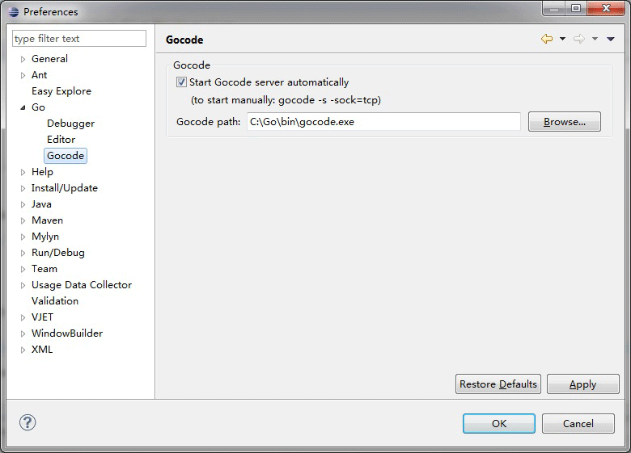

# Go 语言开发工具

## LiteIDE

LiteIDE是一款开源、跨平台的轻量级Go语言集成开发环境（IDE）。

### 支持的操作系统

*   Windows x86 (32-bit or 64-bit)
*   Linux x86 (32-bit or 64-bit)

下载地址 ：[http://sourceforge.net/projects/liteide/files/](http://sourceforge.net/projects/liteide/files/)

源码地址 ：[https://github.com/visualfc/liteide](https://github.com/visualfc/liteide)


## Eclipse

Eclipse也是非常常用的开发利器，以下介绍如何使用Eclipse来编写Go程序。



Eclipse编辑Go的主界面

1.  首先下载并安装好[Eclipse](http://www.eclipse.org/)
2.  下载[goclipse](https://code.google.com/p/goclipse/)插件 [http://code.google.com/p/goclipse/wiki/InstallationInstructions](http://code.google.com/p/goclipse/wiki/InstallationInstructions)
3.  下载gocode，用于go的代码补全提示

    gocode的github地址：

    ```
    https://github.com/nsf/gocode
    ```

    在windows下要安装git，通常用[msysgit](https://code.google.com/p/msysgit/)

    再在cmd下安装：

    ```
    go get -u github.com/nsf/gocode
    ```

    也可以下载代码，直接用go build来编译，会生成gocode.exe

4.  下载[MinGW](http://sourceforge.net/projects/mingw/files/MinGW/)并按要求装好
5.  配置插件

    Windows-&gt;Reference-&gt;Go

    (1).配置Go的编译器

    

    设置Go的一些基础信息

    (2).配置Gocode（可选，代码补全），设置Gocode路径为之前生成的gocode.exe文件

    

    设置gocode信息

    (3).配置GDB（可选，做调试用），设置GDB路径为MingW安装目录下的gdb.exe文件

    

    设置GDB信息

6.  测试是否成功

    新建一个go工程，再建立一个hello.go。如下图：

    

    新建项目编辑文件

    调试如下（要在console中用输入命令来调试）：

    

    图1.16 调试Go程序