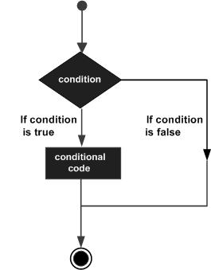

# Go 语言条件语句

条件语句需要开发者通过指定一个或多个条件，并通过测试条件是否为 true 来决定是否执行指定语句，并在条件为 false 的情况在执行另外的语句。

下图展示了程序语言中条件语句的结构：

Go 语言提供了以下几种条件判断语句：

| 语句 | 描述 |
| --- | --- |
| [if 语句](/go/go-if-statement.html "Go if 语句") | **if 语句** 由一个布尔表达式后紧跟一个或多个语句组成。 |
| [if...else 语句](/go/go-if-else-statement.html "Go if...else 语句") | **if 语句** 后可以使用可选的 **else 语句**, else 语句中的表达式在布尔表达式为 false 时执行。 |
| [if 嵌套语句](/go/go-nested-if-statements.html "Go if 嵌套语句") | 你可以在 **if** 或 **else if** 语句中嵌入一个或多个 **if** 或 **else if** 语句。 |
| [switch 语句](/go/go-switch-statement.html "Go switch 语句") | **switch** 语句用于基于不同条件执行不同动作。 |
| [select 语句](/go/go-select-statement.html "Go select 语句") | **select** 语句类似于 **switch** 语句，但是select会随机执行一个可运行的case。如果没有case可运行，它将阻塞，直到有case可运行。 |

