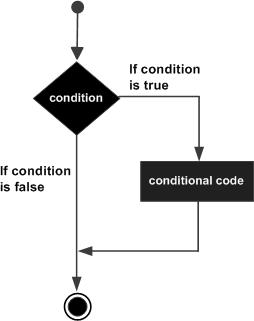

# Go 语言 if 语句


if 语句由布尔表达式后紧跟一个或多个语句组成。

### 语法

Go 编程语言中 if 语句的语法如下：

```
if 布尔表达式 {
   /* 在布尔表达式为 true 时执行 */
}
```

If 在布尔表达式为 true 时，其后紧跟的语句块执行，如果为 false 则不执行。

流程图如下：



### 实例

```
package main

import "fmt"

func main() {
   /* 定义局部变量 */
   var a int = 10
 
   /* 使用 if 语句判断布尔表达式 */
   if a < 20 {
       /* 如果条件为 true 则执行以下语句 */
       fmt.Printf("a 小于 20\n" )
   }
   fmt.Printf("a 的值为 : %d\n", a)
}
```

以上代码执行结果为：

```
a 小于  20 
a 的值为  :  10
```


