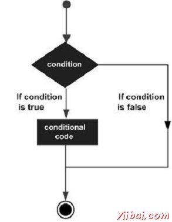

# LISP - 决策 - Lisp教程

决策结构需要程序员指定一个或多个条件由程序进行评估或测试，以及要执行的语句或语句如果条件被确定为true，如果条件被确定为false那么选择要执行其他语句。

下面是在大多数编程语言中一个典型的决策结构的一般形式为：



LISP提供了以下类型的决策构造。点击以下链接，查看其详细信息。

| Construct | 描述 |
| --- | --- |
| cond | 这个结构是用于用于检查多个测试行动作条件。它可以嵌套if或其他编程语言语句。 |
| if | if结构有多种形式。在最简单的形式，它后面跟着一个测试条，测试操作和一些其它相应措施(次)。如果测试子句的值为true，那么测试的动作被执行，否则，由此产生的子句求值。 |
| when | 在最简单的形式，它后面跟着一个测试条和测试操作。如果测试子句的值为true，那么测试的动作被执行，否则，由此产生的子句求值。 |
| case | 这种结构实现了像cond 构造多个测试行动语句。但是，它会评估的关键形式，并允许根据该键的形式评价多个行动语句。 |

## LISP的cond特殊构造

在LISP语言中cond结构是最常用的，以允许分支。

cond的语法是：

```
(cond   (test1    action1)
        (test2    action2)
	     ...
	    (testn   actionn))

```

在cond 语句中每个子句包含一个条件测试，并要执行的动作。

如果第一次测试下面的芯线，为test1，被评估为true，那么相关的行动的一部分， action1执行，返回它的值，及本子句的其余部分被跳过。

如果test1的计算结果是nil，然后控制移动到第二个子句，而不执行action1，和相同的流程进行后续处理。

如果没有试验条件计算结果为真，那么cond语句返回nil。

示例

创建一个名为main.lisp一个新的源代码文件，并在其中输入如下代码：

```
(setq a 10)
(cond ((> a 20)
    (format t "~% a is less than 20"))
(t (format t "~% value of a is ~d " a)))
```

当单击Execute按钮，或按下Ctrl+ E，LISP立即执行它，返回的结果是：

```
value of a is 10
```

请注意，第二个子句中t保证的是，如果没有其他的将最后完成的动作。

## if结构

如果该宏后跟一个测试子句计算为 t 或nil。如果测试子句计算到t，然后按照测试子句的动作被执行。如果它是零，那么下一个子句进行评估计算。

if的语法：

(if (test-clause) (&lt;action1) (action2))

示例1

创建一个名为main.lisp一个新的源代码文件，并在其中输入如下代码：

```
(setq a 10)
(if (> a 20)
    (format t "~% a is less than 20"))
(format t "~% value of a is ~d " a)
```

当单击Execute按钮，或按下Ctrl+ E，LISP立即执行它，返回的结果是：

```
value of a is 10
```

**示例2**

if子句后面可以跟一个可选的then子句：

创建一个名为main.lisp一个新的源代码文件，并在其中输入如下代码：

```
(setq a 10)
(if (> a 20)
    then (format t "~% a is less than 20"))
(format t "~% value of a is ~d " a)

```

当您单击Execute按钮，或按下Ctrl+ E，LISP立即执行它，返回的结果是：

```
a is less than 20
value of a is 10 
```

**示例 3**

还可以创建使用if子句的if-then-else类型声明。

创建一个名为main.lisp一个新的源代码文件，并在其中输入如下代码：

```
(setq a 100)
(if (> a 20)
   (format t "~% a is greater than 20") 
    (format t "~% a is less than 20"))
(format t "~% value of a is ~d " a)

```

当单击Execute按钮，或按下Ctrl+ E，LISP立即执行它，返回的结果是：

```
a is greater than 20
value of a is 100  
```

**when构造，**

该when宏，后面跟着一个测试子句计算为t或为零。如果测试条被评估计算为nil，则任何形式的评估及nil返回，但是它的测试结果为t，则下面的测试条的动作被执行。

when宏的语法：

(when (test-clause) (&lt;action1) )

示例

创建一个名为main.lisp一个新的源代码文件，并在其中输入如下代码：

```
 (setq a 100)
(when (> a 20)
   (format t "~% a is greater than 20"))
(format t "~% value of a is ~d " a)

```

当您单击Execute按钮，或按下Ctrl+ E，LISP立即执行它，返回的结果是：

```
a is greater than 20
value of a is 100 
```

case构造

case结构实现像cond结构多个测试动作语句。但是，它会评估的键形式，并允许根据该键的形式评价多个动作语句。

该case宏的语法是：

The template for CASE is:

```
(case  (keyform)
((key1)   (action1   action2 ...) )
((key2)   (action1   action2 ...) )
...
((keyn)   (action1   action2 ...) ))
```

示例

创建一个名为main.lisp一个新的源代码文件，并在其中输入如下代码：

```
(setq day 4)
(case day
(1 (format t "~% Monday"))
(2 (format t "~% Tuesday"))
(3 (format t "~% Wednesday"))
(4 (format t "~% Thursday"))
(5 (format t "~% Friday"))
(6 (format t "~% Saturday"))
(7 (format t "~% Sunday")))

```

当您单击Execute按钮，或按下Ctrl+ E，LISP立即执行它，返回的结果是：

```
Thursday
```

 