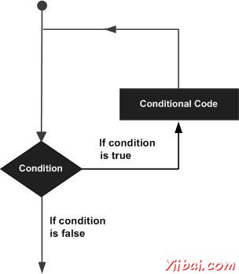

# LISP - 循环 - Lisp教程

可能有一种情况，当需要执行代码块多次。循环语句可以让我们执行一个语句或语句组多次，下面是在大多数编程语言中的循环语句的一般形式为：



LISP提供的结构来处理循环要求以下类型。点击以下链接，查看其详细信息。

| Construct | 描述 |
| --- | --- |
| loop | 循环loop结构是迭代通过LISP提供的最简单的形式。在其最简单的形式，它可以重复执行某些语句(次)，直到找到一个return语句。 |
| loop for | loop结构可以实现一个for循环迭代一样作为最常见于其他语言。 |
| do | do 结构也可用于使用LISP进行迭代。它提供了迭代的一种结构形式。 |
| dotimes | dotimes构造允许循环一段固定的迭代次数。 |
| dolist | dolist来构造允许迭代通过列表的每个元素。 |

## 循环loop结构

循环loop结构是迭代通过LISP提供的最简单的形式。在其最简单的形式，它可以重复执行某些语句(次)，直到找到一个return语句。

它的语法如下：

(loop (s-expressions))

例子

创建一个名为main.lisp一个新的源代码文件，并在其中输入如下代码：

```
(setq a 10)
(loop 
   (setq a (+ a 1))
   (write a)
   (terpri)
   (when (> a 17) (return a)))
```

当执行的代码，它返回以下结果：

```
11
12
13
14
15
16
17
18
```

请注意，没有return语句，循环宏会产生一个无限循环。

## 循环的构造

loop结构可以实现一个for循环迭代一样作为最常见于其他语言。

它可以

*   设置为迭代变量

*   指定表达式（s）表示，将有条件终止迭代

*   对于执行某些任务在每次迭代中指定表达式的结果，

*   做一些任务而退出循环之前指定表达式（s）和表达式

在for循环的结构如下几种语法：

```
(loop for loop-variable in <a list>
   do (action))

(loop for loop-variable from value1 to value2
   do (action))

```

示例1

创建一个名为main.lisp一个新的源代码文件，并在其中输入如下代码：

```
(loop for x in '(tom dick harry)
     do (format t " ~s" x)
)
```

当单击Execute按钮，或按下Ctrl+ E，LISP立即执行它，返回的结果是：

```
TOM DICK HARRY
```

示例2

创建一个名为main.lisp一个新的源代码文件，并在其中输入如下代码：

```
(loop for a from 10 to 20
     do (print a)
)
```

当单击Execute按钮，或按下Ctrl+ E，LISP立即执行它，返回的结果是：

```
10 
11 
12 
13 
14 
15 
16 
17 
18 
19 
20 
```

示例3

创建一个名为main.lisp一个新的源代码文件，并在其中输入如下代码：

```
(loop for x from 1 to 20
  if(evenp x)
  do (print x)
)
```

当单击Execute按钮，或按下Ctrl+ E，LISP立即执行它，返回的结果是：

```
2 
4 
6 
8 
10 
12 
14 
16 
18 
20
```

## do构造

do结构也可用于使用LISP进行迭代。它提供了迭代的一种结构形式。

do语句的语法：

```
(do (variable1       value1       updated-value1)
    (variable2       value2      updated-value2)
    (variable3       value3       updated-value3)
    ...
(test     return-value)
(s-expressions))

```

每个变量的初始值的计算和结合到各自的变量。每个子句中更新的值对应于一个可选的更新语句，指定变量的值将在每次迭代更新。

每次迭代后，将测试结果进行评估计算，并且如果它返回一个nil 或 true，则返回值被求值并返回。

最后一个S-表达式（s）是可选的。如果有，它们每一次迭代后执行，直到测试返回true值。

示例

创建一个名为main.lisp一个新的源代码文件，并在其中输入如下代码：

```
(do ((x 0 (+ 2 x))
    (y 20 ( - y 2)))
    ((= x y)(- x y))
    (format t "~% x = ~d  y = ~d" x y))

```

当单击Execute按钮，或按下Ctrl+ E，LISP立即执行它，返回的结果是：

```
x = 0  y = 20
x = 2  y = 18
x = 4  y = 16
x = 6  y = 14
x = 8  y = 12
```

## dotimes 构造

dotimes构造允许循环一段固定的迭代次数。

实例，

创建一个名为main.lisp一个新的源代码文件，并在其中输入如下代码：

```
(dotimes (n 11)
    (print n) (prin1 (* n n)))

```

当单击Execute按钮，或按下Ctrl+ E，LISP立即执行它，返回的结果是：

```
0 0
1 1
2 4
3 9
4 16
5 25
6 36
7 49
8 64
9 81
10 100
```

## dolist 构造

dolist来构造允许迭代通过列表的每个元素。

实例,

创建一个名为main.lisp一个新的源代码文件，并在其中输入如下代码：

```
(dolist (n '(1 2 3 4 5 6 7 8 9))
    (format t "~% Number: ~d Square: ~d" n (* n n)))
```

当单击Execute按钮，或按下Ctrl+ E，LISP立即执行它，返回的结果是：

```
Number: 1 Square: 1
Number: 2 Square: 4
Number: 3 Square: 9
Number: 4 Square: 16
Number: 5 Square: 25
Number: 6 Square: 36
Number: 7 Square: 49
Number: 8 Square: 64
Number: 9 Square: 81
```

退出块

块返回，从允许从正常情况下的任何错误的任何嵌套块退出。

块功能允许创建一个包含零个或多个语句组成的机构命名块。语法是：

```
(block _block-name_(
...
...
))
```

返回 - 从函数接受一个块名称和可选（默认为零）的返回值。

下面的例子演示了这一点：

示例

创建一个名为main.lisp一个新的源代码文件，并在其中输入如下代码：

```
(defun demo-function (flag)
    (print 'entering-outer-block)
    (block outer-block
      (print 'entering-inner-block)
      (print (block inner-block
               (if flag
                 (return-from outer-block 3)
                 (return-from inner-block 5))
               (print 'This-wil--not-be-printed)))
      (print 'left-inner-block)
      (print 'leaving-outer-block)
      t))
(demo-function t)
(terpri)
(demo-function nil)
```

当单击Execute按钮，或按下Ctrl+ E，LISP立即执行它，返回的结果是：

```
ENTERING-OUTER-BLOCK 
ENTERING-INNER-BLOCK 

ENTERING-OUTER-BLOCK 
ENTERING-INNER-BLOCK 
5 
LEFT-INNER-BLOCK 
LEAVING-OUTER-BLOCK 
```

 