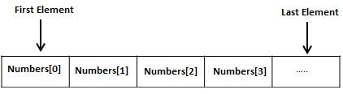

# LISP - 数组 - Lisp教程

LISP允许使用make-array函数来定义一个或多个维数组。一个数组可以任意LISP对象存储为它的元素。

所有数组组成的连续的存储单元。最低的地址对应于第一个元素和最高地址的最后一个元素。



数组的维数被称为它的秩。

在LISP语言中，数组元素是由一个非负整数索引的顺序指定。该序列的长度必须等于数组的秩。索引从0开始。

例如，要创建一个数组，10 - 单元格，命名为my-array，我们可以这样写：

```
(setf my-array (make-array '(10)))
```

aref 函数允许访问该单元格的内容。它有两个参数，数组名和索引值。

例如，要访问的第十单元格的内容，可以这样编写：

```
(aref my-array 9)
```

示例1

创建一个名为main.lisp一个新的源代码文件，并在其中输入如下代码：

```
(write (setf my-array (make-array '(10))))
(terpri)
(setf (aref my-array 0) 25)
(setf (aref my-array 1) 23)
(setf (aref my-array 2) 45)
(setf (aref my-array 3) 10)
(setf (aref my-array 4) 20)
(setf (aref my-array 5) 17)
(setf (aref my-array 6) 25)
(setf (aref my-array 7) 19)
(setf (aref my-array 8) 67)
(setf (aref my-array 9) 30)
(write my-array)
```

当执行以上代码，它返回以下结果：

```
#(NIL NIL NIL NIL NIL NIL NIL NIL NIL NIL)
#(25 23 45 10 20 17 25 19 67 30)
```

**示例 2**

让我们创建一个3×3数组。

创建一个名为main.lisp一个新的源代码文件，并在其中输入如下代码：

```
(setf x (make-array '(3 3) 
              :initial-contents '((0 1 2 ) (3 4 5) (6 7 8))))
(write x)
```

当执行以上代码，它返回以下结果：

```
#2A((0 1 2) (3 4 5) (6 7 8))
```

**示例 3**

创建一个名为main.lisp一个新的源代码文件，并在其中输入如下代码：

```
(setq a (make-array '(4 3)))
(dotimes (i 4)
   (dotimes (j 3)
     (setf (aref a i j) (list i 'x j '= (* i j)))))
(dotimes (i 4)
   (dotimes (j 3)
     (print (aref a i j))))

```

当执行以上代码，它返回以下结果：

```
(0 X 0 = 0) 
(0 X 1 = 0) 
(0 X 2 = 0) 
(1 X 0 = 0) 
(1 X 1 = 1) 
(1 X 2 = 2) 
(2 X 0 = 0) 
(2 X 1 = 2) 
(2 X 2 = 4) 
(3 X 0 = 0) 
(3 X 1 = 3) 
(3 X 2 = 6)
```

**make-array函数完整的语法**

make-array函数需要许多其他的参数。让我们来看看这个函数的完整语法：

```
make-array dimensions :element-type :initial-element :initial-contents :adjustable :fill-yiibaier  :displaced-to :displaced-index-offset
```

除了维度参数，所有其他参数都是关键字。下表提供的参数简要说明。

| 参数 | 描述 |
| --- | --- |
| dimensions | 它给该数组的大小。它是一个数字为一维数组，而对于多维数组列表。 |
| :element-type | 它是类型说明符，默认值是T，即任何类型 |
| :initial-element | 初始元素值。它将使一个数组的所有初始化为一个特定值的元素。 |
| :initial-content | 初始内容作为对象。 |
| :adjustable | 它有助于创造一个可调整大小(或可调)向量，其底层的内存可以调整大小。该参数是一个布尔值，表示数组是否可调与否，默认值是nil。 |
| :fill-yiibaier | 它跟踪实际存储在一个可调整大小的矢量元素的数目 |
| :displaced-to | 它有助于创造一个移位的数组或共享数组共享其内容与指定的数组。这两个数组应该有相同的元素类型。位移到选项可能无法使用:displaced-to或:initial-contents选项。此参数默认为nil。 |
| :displaced-index-offset | 它给出了索引偏移创建的共享数组。 |

**示例4**

创建一个名为main.lisp一个新的源代码文件，并在其中输入如下代码：

```
(setq myarray (make-array '(3 2 3) 
            :initial-contents 
            '(((a b c) (1 2 3)) 
              ((d e f) (4 5 6)) 
              ((g h i) (7 8 9)) 
              ))) 
(setq array2 (make-array 4 :displaced-to myarray 
                      :displaced-index-offset 2)) 
(write myarray)
(terpri)
(write array2)
```

当执行以上代码，它返回以下结果：

```
#3A(((A B C) (1 2 3)) ((D E F) (4 5 6)) ((G H I) (7 8 9)))
#(C 1 2 3)
```

若对数组是二维的：

```
(setq myarray (make-array '(3 2 3) 
            :initial-contents 
            '(((a b c) (1 2 3)) 
              ((d e f) (4 5 6)) 
              ((g h i) (7 8 9)) 
              ))) 
(setq array2 (make-array '(3 2) :displaced-to myarray 
                      :displaced-index-offset 2)) 
(write myarray)
(terpri)
(write array2)

```

当执行以上代码，它返回以下结果：

```
#3A(((A B C) (1 2 3)) ((D E F) (4 5 6)) ((G H I) (7 8 9)))
#2A((C 1) (2 3) (D E))
```

让我们改变流离指数偏移量5：

```
(setq myarray (make-array '(3 2 3) 
            :initial-contents 
            '(((a b c) (1 2 3)) 
              ((d e f) (4 5 6)) 
              ((g h i) (7 8 9)) 
              ))) 
(setq array2 (make-array '(3 2) :displaced-to myarray 
                      :displaced-index-offset 5)) 
(write myarray)
(terpri)
(write array2)

```

当执行以上代码，它返回以下结果：

```
#3A(((A B C) (1 2 3)) ((D E F) (4 5 6)) ((G H I) (7 8 9)))
#2A((3 D) (E F) (4 5))
```

**示例5**

创建一个名为main.lisp一个新的源代码文件，并在其中输入如下代码：

```
;a one dimensional array with 5 elements, 
;initail value 5
(write (make-array 5 :initial-element 5))
(terpri)
;two dimensional array, with initial element a
(write (make-array '(2 3) :initial-element 'a))
(terpri)
;an array of capacity 14, but fill yiibaier 5, is 5
(write(length (make-array 14 :fill-yiibaier 5)))
(terpri)
;however its length is 14
(write (array-dimensions (make-array 14 :fill-yiibaier 5)))
(terpri)
; a bit array with all initial elements set to 1
(write(make-array 10 :element-type 'bit :initial-element 1))
(terpri)
; a character array with all initial elements set to a
; is a string actually
(write(make-array 10 :element-type 'character :initial-element #a)) 
(terpri)
; a two dimensional array with initial values a
(setq myarray (make-array '(2 2) :initial-element 'a :adjustable t))
(write myarray)
(terpri)
;readjusting the array
(adjust-array myarray '(1 3) :initial-element 'b) 
(write myarray)

```

当执行以上代码，它返回以下结果：

```
#(5 5 5 5 5)
#2A((A A A) (A A A))
5
(14)
#*1111111111
"aaaaaaaaaa"
#2A((A A) (A A))
#2A((A A B))
```

 