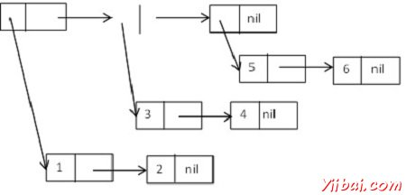

# LISP - 树 - Lisp教程

可以从cons单元构建树的数据结构，如清单列表。

为了实现树形结构，则必须设计功能，将遍历cons 单元，在特定的顺序，例如，前序，顺序和后序的二进制树。

## 树列表的列表

让我们考虑由cons单元的树状结构，形成列出的清单如下：

((1 2) (3 4) (5 6)).

图解，它可以表示为：



## LISP树的功能

虽然多数时候仍需要根据其它特殊需求编写自己的树的功能，LISP提供了一些树的功能，您可以使用。

除了所有列表函数，以下是工作在树结构函数：

| 函数 | 描述 |
| --- | --- |
| **copy-tree** x &optional vecp | 它返回cons单元×树的副本。它递归地拷贝两款车和cdr方向。如果x不是一个cons单元，该函数只返回x不变。如果可选vecp参数为true，这个函数将向量（递归），以及cons单元。 |
| tree-equal x y &key :test :test-not :key | 它比较两棵树的cons单元。如果x和y是两个cons单元，他们的汽车和cdr是递归比较。如果x和y都不是一个cons单元，它们是由eql比较，或根据指定的测试。:key函数，如果指定，应用到这两个目录树中的元素。 |
| **subst** new old tree &key :test :test-not :key | 它可以代替出现给老项与新项，在树，这是cons单元的一棵树。 |
| **nsubst** new old tree &key :test :test-not :key | 它的工作原理与subst相同，但它破坏了原来的树。 |
| **sublis** alist tree &key :test :test-not :key | 它的工作原理就像subst，只不过它采用的新旧对关联表alist。树（应用后:key函数，如果有的话）中的每个元素，与alist的车相比;如果它匹配，它被替换为相应的cdr。 |
| **nsublis** alist tree &key :test :test-not :key | 它的工作原理与sublis相同，而是一个破坏性的版本。 |

**示例 1**

创建一个名为main.lisp一个新的源代码文件，并在其中输入如下代码：

```
(setq lst (list '(1 2) '(3 4) '(5 6)))
(setq mylst (copy-list lst))
(setq tr (copy-tree lst))
(write lst)
(terpri)
(write mylst)
(terpri)
(write tr)
```

当执行代码，它返回以下结果：

```
((1 2) (3 4) (5 6))
((1 2) (3 4) (5 6))
((1 2) (3 4) (5 6))
```

**示例 2**

创建一个名为main.lisp一个新的源代码文件，并在其中输入如下代码：

```
(setq tr '((1 2 (3 4 5) ((7 8) (7 8 9)))))
(write tr)
(setq trs (subst 7 1 tr))
(terpri)
(write trs)

```

当执行代码，它返回以下结果：

```
((1 2 (3 4 5) ((7 8) (7 8 9))))
((7 2 (3 4 5) ((7 8) (7 8 9))))
```

## 建立自己的树

让我们尝试建立自己的树，使用LISP列表功能。

## 首先，让我们创建一个包含一些数据的新节点：

```
(defun make-tree (item)
  "it creates a new node with item."
  (cons (cons item nil) nil))
```

**接下来让我们添加一个子节点插入到树：**它会采取两种树节点，并添加第二棵树作为第一个的子树。

```
(defun add-child (tree child)
  (setf (car tree) (append (car tree) child))
  tree)
```

**接下来让我们添加一个子节点插入到树：**这将需要一个树节点，并返回该节点第一个子节点，或nil，如果这个节点没有任何子节点。

```
(defun first-child (tree)
  (if (null tree)
    nil
    (cdr (car tree))))

```

**这个函数会返回一个给定节点的下一个同级节点：**它需要一个树节点作为参数，并返回一个指向下一个同级节点，或者为nil，如果该节点没有任何。

```
(defun next-sibling (tree)
   (cdr tree))
```

**最后，我们需要一个函数来返回一个节点的信息：**

```
(defun data (tree)
  (car (car tree)))
```

**示例**

本示例使用上述功能：

创建一个名为main.lisp一个新的源代码文件，并在其中输入如下代码：

```
(defun make-tree (item)
  "it creates a new node with item."
  (cons (cons item nil) nil))
 (defun first-child (tree)
  (if (null tree)
    nil
    (cdr (car tree))))
 (defun next-sibling (tree)
   (cdr tree))
(defun data (tree)
   (car (car tree)))
 (defun add-child (tree child)
  (setf (car tree) (append (car tree) child))
  tree)

(setq tr '((1 2 (3 4 5) ((7 8) (7 8 9)))))
(setq mytree (make-tree 10))
(write (data mytree))
(terpri)
(write (first-child tr))
(terpri)
(setq newtree (add-child tr mytree))
(terpri)
(write newtree)

```

当执行代码，它返回以下结果：

```
10
(2 (3 4 5) ((7 8) (7 8 9)))

((1 2 (3 4 5) ((7 8) (7 8 9)) (10)))
```

 