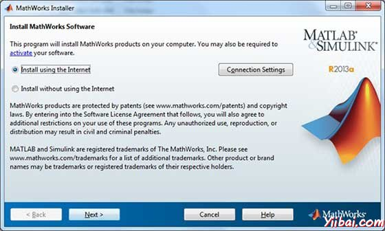

# MATLAB安装 - Matlab教程

## 本地环境设置安装

如果愿意设立环境，MATLAB 安装与一般软件没有什么不同，点击几个“下一步”就可以了。需要先下载安装 [下载](https://www.mathworks.com/downloads/web_downloads/):

MathWorks公司提供授权产品的试用版和学生版以及。需要登录到 MathWorks 官方网站。

一旦获得了下载链接，这是一个只需几下点击：

## 了解MATLAB环境：

可以从桌面上创建的图标启动 MATLAB 开发IDE。 MATLAB 主要工作窗口称为桌面。当启动MATLAB，桌面会出现它的默认布局：

桌面有以下面板：

*   当前文件夹 - 此面板允许访问项目文件夹和文件。

    
*   命令窗口 - 这是主要区域，用户在命令行中输入命令，命令提示符(&gt;&gt;).

    
*   工作区 - 工作区显示所有创建的变量和/或从文件导入。

    
*   命令历史记录 - 此面板显示或重新运行，在命令行中输入的命令。

    

## 安装 GNU Octave

如果愿意在你的机器上使用Octave （Linux，BSD，Mac OS X或Windows），然后请下载最新版本下载 GNU Octave 。可以检查你的机器的安装指导。

