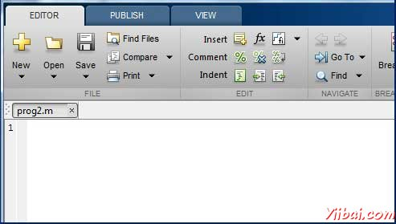

# MATLAB M-Files - Matlab教程

到目前为止，我们已经使用了MATLAB环境下，作为一个计算器。然而，[MATLAB](http://www.yiibai.com/matlab) 是一个功能强大的编程语言，以及交互式计算环境。

在前面的章节中，已经学会如何从 MATLAB 命令提示符下输入命令。 MATLAB 还允许你写入到一个文件中的一系列命令和执行文件完整的单元，就像写一个函数，并调用它。

## M 文件

MATLAB允许写两个程序文件：

*   脚本 - 脚本文件 .m 扩展程序文件。在这些文件中写的一系列命令，想一起执行。脚本不接受输入和不返回任何输出。他们在工作区中的数据操作。

*   函数 -函数文件 .m 扩展程序文件。函数可以接受输入和返回输出。内部变量是本地的函数。

可以使用MATLAB 编辑器或其他任何文本编辑器来创建 .m 文件。在本节中，我们将讨论的脚本文件。 MATLAB 命令和函数调用的脚本文件包含多个连续的行。可以运行一个脚本，在命令行中键入其名称。

## 创建并运行脚本文件

创建脚本文件，需要使用文本编辑器。可以打开 MATLAB 编辑器，可使用两个方法：

*   使用命令提示符

*   使用IDE

如果是在命令提示符下使用命令提示符下，键入编辑。这将打开编辑器。可以直接键入编辑，然后在文件名（ .m 扩展程序文件名）

```
edit 
Or
edit <filename>
```

上面的命令将在默认情况下，MATLAB 目录中创建文件。如果想存储在一个特定的文件夹中的所有程序文件，那么一定要提供整个路径。

让我们创建一个文件夹名为 progs。在命令提示符处键入以下命令（&gt;&gt;）：

```
mkdir progs    % create directory progs under default directory
chdir progs    % changing the current directory to progs
edit  prog1.m  % creating an m file named prog1.m
```

如果首次创建的文件，MATLAB 会提示您进行确认。单击“Yes”。



另外，如果使用的是IDE，选择 NEW -&gt; Script。这也打开编辑器，并创建一个文件名为命名。输入代码后可以命名并保存文件。

在编辑器中输入下面的代码：

```
NoOfStudents = 6000;
TeachingStaff = 150;
NonTeachingStaff = 20;
Total = NoOfStudents + TeachingStaff ...
    + NonTeachingStaff;
disp(Total);
```

创建和保存文件后，可以运行在两个方面：

*   编辑器窗口中单击“Run”按钮或

*   只要在命令提示符下键入文件名（不含扩展名）：&gt;&gt; prog1

命令窗口提示显示的结果是：

```
6170

```

## 例子

创建一个脚本文件，然后输入下面的代码：

```
a = 5; b = 7;
c = a + b
d = c + sin(b)
e = 5 * d
f = exp(-d)
```

上面的代码编译和执行时，它会产生以下结果：

```
c =
    12
d =
   12.6570
e =
   63.2849
f =
   3.1852e-06
```

 