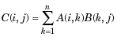

# MATLAB运算符 - Matlab教程

运算符是一个符号，它告诉编译器执行特定的数学或逻辑操作。 MATLAB 设计工作主要是对整个矩阵和阵列。因此，运算符在 MATLAB 工作标和非标量数据。 MATLAB 允许以下类型的基本运算：

*   算术运算符

*   关系运算符

*   逻辑运算符

*   位运算

*   集合运算

## 算术运算符

MATLAB允许两种不同类型的算术运算：

*   矩阵算术运算

*   阵列算术运算

矩阵的算术运算是线性代数中的定义相同。执行数组操作，无论是在一维和多维数组元素的元素。

矩阵运算符和数组运算符是有区别的句号（.）符号。然而，由于加法和减法运算矩阵和阵列是相同的，操作者这两种情况下是相同的。下表给出了运算符的简要说明：

[详细例子](http://www.yiibai.com/matlab/matlab_arithmetic_operators.html "Arithmetic Operators in MATLAB")

| 运算符 | 描述 |
| --- | --- |
| **+** | 加法或一元加号。A + B将A和B。 A和B必须具有相同的尺寸，除非一个人是一个标量。一个标量，可以被添加到任何大小的矩阵。 |
| **-** | Subtraction or unary minus. A-B subtracts B from A. A and B must have the same size, unless one is a scalar. A scalar can be subtracted from a matrix of any size. |
| ***** | Matrix multiplication. C = A*B is the linear algebraic product of the matrices A and B. More precisely,For nonscalar A and B, the number of columns of A must equal the number of rows of B. A scalar can multiply a matrix of any size. |
| **.*** | Array multiplication. A.*B is the element-by-element product of the arrays A and B. A and B must have the same size, unless one of them is a scalar. |
| **/** | Slash or matrix right division. B/A is roughly the same as B*inv(A). More precisely, B/A = (A'B')'. |
| **./** | Array right division. A./B is the matrix with elements A(i,j)/B(i,j). A and B must have the same size, unless one of them is a scalar. |
 Backslash or matrix left division. If A is a square matrix, AB is roughly the same as inv(A)*B, except it is computed in a different way. If A is an n-by-n matrix and B is a column vector with n components, or a matrix with several such columns, then X = AB is the solution to the equation _AX = B_. A warning message is displayed if A is badly scaled or nearly singular. |
| **.** | Array left division. A.B is the matrix with elements B(i,j)/A(i,j). A and B must have the same size, unless one of them is a scalar. |
| **^** | Matrix power. X^p is X to the power p, if p is a scalar. If p is an integer, the power is computed by repeated squaring. If the integer is negative, X is inverted first. For other values of p, the calculation involves eigenvalues and eigenvectors, such that if [V,D] = eig(X), then X^p = V*D.^p/V. |
| **.^** | Array power. A.^B is the matrix with elements A(i,j) to the B(i,j) power. A and B must have the same size, unless one of them is a scalar. |
| **'** | Matrix transpose. A' is the linear algebraic transpose of A. For complex matrices, this is the complex conjugate transpose. |
| **.'** | Array transpose. A.' is the array transpose of A. For complex matrices, this does not involve conjugation. |

## 关系运算符

关系运算符标和非标量数据上也能正常工作。关系运算符对数组进行元素元素元素设置为逻辑1（真）的关系是真实的和元素设置为逻辑0（假），它是两个阵列，并返回一个同样大小的逻辑阵列之间的比较。

下表显示了 MATLAB 中的关系运算符：

[Show Examples](http://www.yiibai.com/matlab/matlab_relational_operators.html "Relational Operators in MATLAB")

| 运算符 | 描述 |
| --- | --- |
| **&lt;** | Less than |
| **&lt;=** | Less than or equal to |
| **&gt;** | Greater than |
| **&gt;=** | Greater than or equal to |
| **==** | Equal to |
| **~=** | Not equal to |

## 逻辑运算符

MATLAB提供了两种类型的逻辑运算符和函数：

*   Element-wise -这些运算符的逻辑阵列上运行相应的元素。

*   Short-circuit -这些运算上的标量，逻辑表达式。

Element-wise 的逻辑运算符操作元素元素逻辑阵列。符号＆，|和〜逻辑数组运算符AND，OR，NOT。

允许短路短路逻辑运算符，逻辑运算。符号 && 和 | | 是短路逻辑符 AND 和 OR。

[Show Examples](http://www.yiibai.com/matlab/matlab_logical_operators.html "Logical Operators in MATLAB")

## 位运算

位运算符位和执行位位操作。 ＆，|和^的真值表如下：

| p | q | p & q | p &#124; q | p ^ q |
| --- | --- | --- | --- | --- |
| 0 | 0 | 0 | 0 | 0 |
| 0 | 1 | 0 | 1 | 1 |
| 1 | 1 | 1 | 1 | 0 |
| 1 | 0 | 0 | 1 | 1 |

假设如果A= 60，B =13，他们现在以二进制格式将如下：

A = 0011 1100

B = 0000 1101

-----------------

A&B = 0000 1100

A|B = 0011 1101

A^B = 0011 0001

~A = 1100 0011

MATLAB提供位运算，如'位'，'位'和'位不操作，移位操作等各种函数

以下的表格显示了常用的按位运算：

[Show Examples](http://www.yiibai.com/matlab/matlab_bitwise_operators.html "Bitwise Operators in MATLAB")

| 函数 | 目的/作用 |
| --- | --- |
| bitand(a, b) | Bit-wise AND of integers _a_ and _b_ |
| bitcmp(a) | Bit-wise complement of _a_ |
| bitget(a,pos) | Get bit at specified position _pos_, in the integer array _a_ |
| bitor(a, b) | Bit-wise OR of integers _a_ and _b_ |
| bitset(a, pos) | Set bit at specific location _pos_ of _a_ |
| bitshift(a, k) | Returns _a_ shifted to the left by _k_ bits, equivalent to multiplying by 2&lt;sup style="margin: 0px; padding: 0px; font-size: 13px;"&gt;k&lt;/sup&gt;. Negative values of k correspond to shifting bits right or dividing by 2&lt;sup style="margin: 0px; padding: 0px; font-size: 13px;"&gt;&#124;k&#124;&lt;/sup&gt; and rounding to the nearest integer towards negative infinite. Any overflow bits are truncated. |
| bitxor(a, b) | Bit-wise XOR of integers _a_ and _b_ |
| swapbytes | Swap byte ordering |

## 集合操作符

MATLAB提供各种功能集合运算，如集，交集和测试组成员等。

下表显示了一些常用的设置操作：

[Show Examples](http://www.yiibai.com/matlab/matlab_set_operators.html "Set Operations in MATLAB")

| 函数 | 描述 |
| --- | --- |
| intersect(A,B) | Set intersection of two arrays; returns the values common to both A and B. The values returned are in sorted order. |
| intersect(A,B,'rows') | Treats each row of A and each row of B as single entities and returns the rows common to both A and B. The rows of the returned matrix are in sorted order. |
| ismember(A,B) | Returns an array the same size as A, containing 1 (true) where the elements of A are found in B. Elsewhere, it returns 0 (false). |
| ismember(A,B,'rows') | Treats each row of A and each row of B as single entities and returns a vector containing 1 (true) where the rows of matrix A are also rows of B. Elsewhere, it returns 0 (false). |
| issorted(A) | Returns logical 1 (true) if the elements of A are in sorted order and logical 0 (false) otherwise. Input A can be a vector or an N-by-1 or 1-by-N cell array of strings. A is considered to be sorted if A and the output of sort(A) are equal. |
| issorted(A, 'rows') | Returns logical 1 (true) if the rows of two-dimensional matrix A are in sorted order, and logical 0 (false) otherwise. Matrix A is considered to be sorted if A and the output of sortrows(A) are equal. |
| setdiff(A,B) | Set difference of two arrays; returns the values in A that are not in B. The values in the returned array are in sorted order. |
| setdiff(A,B,'rows') | Treats each row of A and each row of B as single entities and returns the rows from A that are not in B. The rows of the returned matrix are in sorted order.The 'rows' option does not support cell arrays. |
| setxor | Set exclusive OR of two arrays |
| union | Set union of two arrays |
| unique | Unique values in array |

