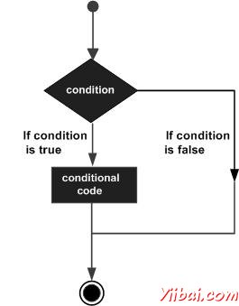

# MATLAB决策制定 - Matlab教程

决策结构要求程序员指定一个或多个条件进行评估或测试程序，沿一条或多条语句执行，如果条件被确定为真，以及可选，其他要执行的语句，如果条件确定是假的 (false)。

以下是一个典型的决策结构，发现在大多数编程语言的一般形式：

[MATLAB](http://www.yiibai.com/matlab) 提供以下类型的决策报表。点击以下链接，以检查他们的细节：

| 语句 | 描述 |
| --- | --- |
| [if ... end statement](http://www.yiibai.com/matlab/if_end_statement_matlab.html "if end statement in MATLAB") | An **if ... end statement** consists of a boolean expression followed by one or more statements. |
| [if...else...end statement](http://www.yiibai.com/matlab/if_else_statement_matlab.html "if...else statement in MATLAB") | An **if statement** can be followed by an optional **else statement**, which executes when the boolean expression is false. |
| [If... elseif...elseif...else...end statements](http://www.yiibai.com/matlab/if_elseif_else_statement.html "if elseif else statements in MATLAB") | An **if** statement can be followed by an (or more) optional **elseif...**and an **else** statement, which is very useful to test various condition. |
| [nested if statements](http://www.yiibai.com/matlab/nested_if_statements_matlab.html "nested if statements in MATLAB") | You can use one **if** or **elseif** statement inside another **if** or **elseif** statement(s). |
| [switch statement](http://www.yiibai.com/matlab/switch_statement_matlab.html "switch statement in MATLAB") | A **switch** statement allows a variable to be tested for equality against a list of values. |
| [nested switch statements](http://www.yiibai.com/matlab/nested_switch_statements_matlab.html "nested switch statements in MATLAB") | You can use one **swicth** statement inside another **switch** statement(s). |

