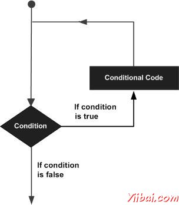

# MATLAB循环类型 - Matlab教程

可能有一种情况，当需要执行的代码块几次数。在一般情况下语句顺序执行。先在一个函数中的第一条语句执行，接着是第二个，并依此类推。

编程语言都提供了各种控制结构，允许更复杂的执行路径。

循环语句允许我们执行一个语句或语句组多次，下面是在大多数编程语言中的循环语句的一般形式：

MATLAB 提供以下类型的循环处理循环的要求。点击以下链接，以检查他们的细节：

| 循环类型 | 描述 |
| --- | --- |
| [while 循环](http://www.yiibai.com/matlab/matlab_while_loop.html "while loop in MATLAB") | 一个给定的条件为真时重复语句或语句组。测试条件才执行循环体。 |
| [for 循环](http://www.yiibai.com/matlab/matlab_for_loop.html "for loop in MATLAB") | 执行的语句序列多次缩写管理循环变量的代码。 |
| [nested 循环](http://www.yiibai.com/matlab/matlab_nested_loops.html "nested loops in MATLAB") | 可以使用一个或多个环路内任何另一个循环。 |

## 循环控制语句

循环控制语句更改执行其正常的顺序。当执行留下了范围，在该范围内所有自动创建的对象被销毁。

MATLAB支持以下控制语句。请点击以下链接，以检查他们的细节。

| 控制语句 | 描述 |
| --- | --- |
| [break 语句](http://www.yiibai.com/matlab/matlab_break_statement.html "break statement in MATLAB") | 终止循环语句，将执行的语句紧随循环。 |
| [continue 语句](http://www.yiibai.com/matlab/matlab_continue_statement.html "continue statement in MATLAB") | 导致循环，跳过它的身体的其余部分，并立即重新再次测试前的状况。 |

