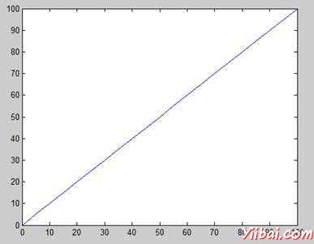
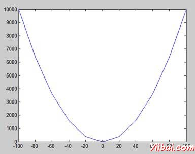
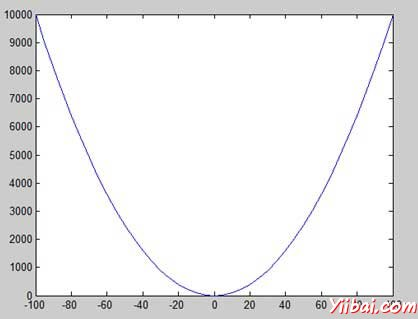
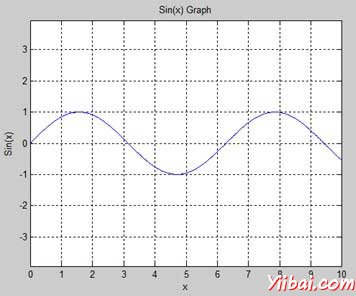
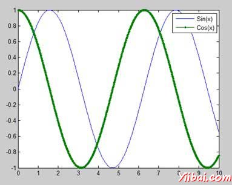
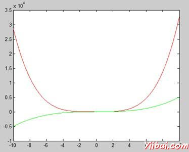
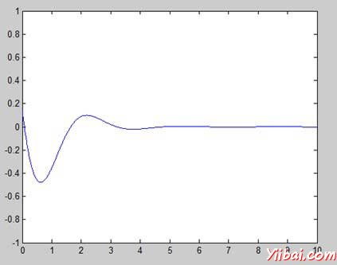
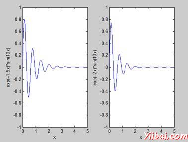

# MATLAB绘图 - Matlab教程

要绘制函数图形，需要采取以下步骤：

1.  定义x，通过指定的变量 x 值的范围，该函数被绘制

2.  定义函数, y = f(x)

3.  调用plot命令，如 plot(x, y)

下面的例子演示了这一概念。让我们绘制简单的函数y = x , x值的范围从0到100，增量为5。

创建一个脚本文件，并输入下面的代码：

```
x = [0:5:100];
y = x;
plot(x, y)
```

当运行该文件，MATLAB显示下面的图形：



让我们举一个例子，绘制函数y = x&lt;sup style="margin: 0px; padding: 0px; font-size: 13px;"&gt;2&lt;/sup&gt;。在这个例子中，我们将绘制两个图形具有相同的函数，但在第二次，我们将减少值的增量。请注意，因为我们减少增量，图形变得平滑。

创建一个脚本文件，并输入下面的代码：

```
x = [1 2 3 4 5 6 7 8 9 10];
x = [-100:20:100];
y = x.^2;
plot(x, y)
```

当您运行该文件，MATLAB显示下面的图形：



更改代码文件小，减少增量5：

```
x = [-100:5:100];
y = x.^2;
plot(x, y)
```

MATLAB绘制一条平滑的曲线图：



## 添加标题，标签，网格线和缩放的图形

MATLAB允许添加标题，调整轴的x轴和y轴，网格线，并沿标签美化图形。

*   xlabel和ylabel指令的产生沿x轴和y轴的标签。

*   标题命令允许你把图表上的一个标题。

*   网格命令允许你把图上的网格线。

*   轴等于命令允许生成与同等规模因素和空间两个坐标轴上的积点。

*   轴方形命令生成一个正方形的积点。

## 示例

创建一个脚本文件，并输入下面的代码：

```
x = [0:0.01:10];
y = sin(x);
plot(x, y), xlabel('x'), ylabel('Sin(x)'), title('Sin(x) Graph'),
grid on, axis equal
```

MATLAB生成如下图：



## 在同一张图上绘制多个函数

您可以绘制多个图形相同的积点。下面的例子演示了这一概念：

## 示例

创建一个脚本文件，并输入下面的代码：

```
x = [0 : 0.01: 10];
y = sin(x);
g = cos(x);
plot(x, y, x, g, '.-'), legend('Sin(x)', 'Cos(x)')
```

MATLAB生成如下图：



## 在走势图上的颜色设置

MATLAB提供八个基本绘制图形的颜色选项。下表显示的颜色和他们的代码：

| Color | Code |
| --- | --- |
| White | **w** |
| Black | **k** |
| Blue | **b** |
| Red | **r** |
| Cyan | **c** |
| Green | **g** |
| Magenta | **m** |
| Yellow | **y** |

## 示例

让我们绘制图形两个多项式

1.  f(x) = 3x&lt;sup style="margin: 0px; padding: 0px; font-size: 13px;"&gt;4&lt;/sup&gt; + 2x&lt;sup style="margin: 0px; padding: 0px; font-size: 13px;"&gt;3&lt;/sup&gt;+ 7x&lt;sup style="margin: 0px; padding: 0px; font-size: 13px;"&gt;2&lt;/sup&gt; + 2x + 9 and

2.  g(x) = 5x&lt;sup style="margin: 0px; padding: 0px; font-size: 13px;"&gt;3&lt;/sup&gt; + 9x + 2

创建一个脚本文件，并输入下面的代码：

```
x = [-10 : 0.01: 10];
y = 3*x.^4 + 2 * x.^3 + 7 * x.^2 + 2 * x + 9;
g = 5 * x.^3 + 9 * x + 2;
plot(x, y, 'r', x, g, 'g')
```

当您运行该文件，MATLAB生成下图：



## 设置轴刻度

该的轴命令允许您设置轴的刻度。您可以提供的最小值和最大值的x和y轴以下列方式使用轴命令：

```
axis ( [xmin xmax ymin ymax] )
```

下面的例子显示了这一点：

## 示例

创建一个脚本文件，并输入下面的代码：

```
x = [0 : 0.01: 10];
y = exp(-x).* sin(2*x + 3);
plot(x, y), axis([0 10 -1 1])
```

当您运行该文件，MATLAB生成下图：



## 生成子图

当创建一个数组地块在相同的数字，这些地块被称为子图。subplot 命令创建子图。

该命令的语法是：

```
subplot(m, n, p)
```

其中，m和n积阵列的行和列的数量，p指定把一个特定的积。

subplot 命令创建的每个绘图都可以有其自己的特点。下面的例子演示了这一概念：

## 示例

让我们产生两个图：

y = e&lt;sup style="margin: 0px; padding: 0px; font-size: 13px;"&gt;−1.5x&lt;/sup&gt;sin(10x)

y = e&lt;sup style="margin: 0px; padding: 0px; font-size: 13px;"&gt;−2x&lt;/sup&gt;sin(10x)

创建一个脚本文件，并输入下面的代码：

```
x = [0:0.01:5];
y = exp(-1.5*x).*sin(10*x);
subplot(1,2,1)
plot(x,y), xlabel('x'),ylabel('exp(–1.5x)*sin(10x)'),axis([0 5 -1 1])
y = exp(-2*x).*sin(10*x);
subplot(1,2,2)
plot(x,y),xlabel('x'),ylabel('exp(–2x)*sin(10x)'),axis([0 5 -1 1])
```

当您运行该文件，MATLAB生成下图：

  