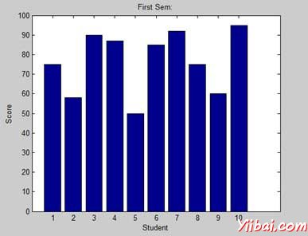
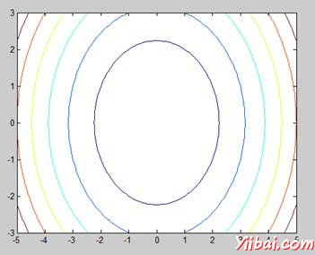
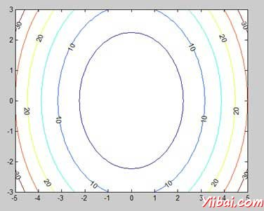
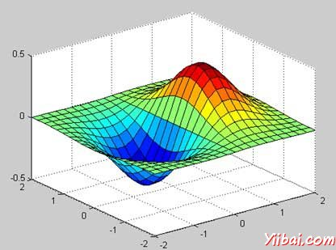

# MATLAB图形 - Matlab教程

本章将继续探索MATLAB绘图和图形功能。我们将讨论：

*   绘制条形图

*   绘制等值线

*   三维图

## 绘制条形图

bar 命令绘制一个二维条形图。让我们采取了一个例子来证明这个想法。

## 示例

让我们有一个假想的有10名学生的教室。我们知道这些学生获得的分数的百分比是75，58，90，87，50，85，92，75，60和95。这个数据，我们将绘制条形图。

创建一个脚本文件，并输入下面的代码：

```
x = [1:10];
y = [75, 58, 90, 87, 50, 85, 92, 75, 60, 95];
bar(x,y), xlabel('Student'),ylabel('Score'),
title('First Sem:')
print -deps graph.eps
```

当运行该文件，MATLAB显示以下的棒形图：



## 绘制等值线

contour 线的两个变量的函数的曲线，沿着该函数具有一个恒定值。加入等于标高点，一个给定的水平，如平均海平面以上用于创建等高线图等高线。

MATLAB 提供了一个轮廓绘制等高线图的函数。

## 例子

让我们生成的等高线图，显示了对于一个给定的功能的轮廓线 g = f(x, y)。这个函数有两个变量。因此，我们将生成两个独立的变量，即两个数据集 x和y。这是通过调用meshgrid 命令。

meshgrid命令是用于产生一个矩阵的元素，赋予x和y的范围内进行了在每一种情况下的增量同规格一起。

让我们绘制函数 g = f(x, y), where −5 ≤ x ≤ 5, −3 ≤ y ≤ 3\. 让我们来为这两个值的增量为0.1。这些变量设置为：

```
[x,y] = meshgrid(–5:0.1:5, –3:0.1:3);
```

最后，我们需要分配功能。函数是：x&lt;sup style="margin: 0px; padding: 0px; font-size: 13px;"&gt;2&lt;/sup&gt; + y&lt;sup style="margin: 0px; padding: 0px; font-size: 13px;"&gt;2&lt;/sup&gt;

创建一个脚本文件，并键入下面的代码：

```
[x,y] = meshgrid(-5:0.1:5,-3:0.1:3); %independent variables
g = x.^2 + y.^2;                     % our function
contour(x,y,g)                       % call the contour function
print -deps graph.eps
```

当运行该文件，MATLAB显示下面的等高线图：



让我们修改代码，一点点地美化了等高线图：

```
[x,y] = meshgrid(-5:0.1:5,-3:0.1:3); %independent variables
g = x.^2 + y.^2;                     % our function
[C, h] = contour(x,y,g);             % call the contour function
set(h,'ShowText','on','TextStep',get(h,'LevelStep')*2)
print -deps graph.eps
```

当您运行该文件，MATLAB显示下面的等高线图：



## 三维图

三维绘图基本显示两个变量中的一个函数定义的表面, g = f (x,y).

像以前一样，定义g，我们首先创建一组点（X，Y）函数，使用meshgrid命令在域。接下来，我们该函数本身分配。最后使用surf 命令来创建曲面图。

下面的例子演示了这一概念：

## 示例

让我们创建一个三维地图函数表面 g = xe&lt;sup style="margin: 0px; padding: 0px; font-size: 13px;"&gt;-(x&lt;sup style="margin: 0px; padding: 0px; font-size: 13px;"&gt;2&lt;/sup&gt; + y&lt;sup style="margin: 0px; padding: 0px; font-size: 13px;"&gt;2&lt;/sup&gt;)&lt;/sup&gt;

创建一个脚本文件，并输入下面的代码：

```
[x,y] = meshgrid(-2:.2:2);
g = x .* exp(-x.^2 - y.^2);
surf(x, y, g)
print -deps graph.eps
```

当您运行该文件，MATLAB 显示下面的3-D地图：



也可以使用的网格的命令来生成一个三维表面。然而，surfcommand显示连接线和面的表面的颜色，而meshcommand 创建一个线框表面色线，连接定义点。

 