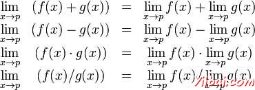
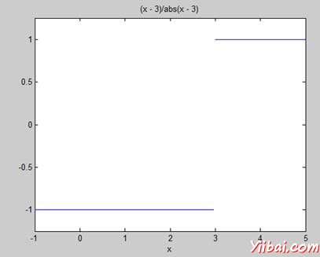

# MATLAB微积分 - Matlab教程

MATLAB 提供解决微积分的各种问题，微分方程求解的任何限制的程度和计算方法。最重要的是可以很容易地绘制图形复变函数，并检查最大值，最小值和图形解决原始函数，以及其衍生的其他内容。

在本章中，我们将在未来几章演算处理的问题。在本章中，我们将讨论预演算概念，即，计算功能的限制和验证的属性限制。

我们将在下一章微分，计算衍生的表达，并在图表上找到当地的最大值和最小值。我们还将讨论微分方程求解。

最后，在“集成”一章中，我们将讨论积分。

## 计算限制

MATLAB提供limit命令限制的计算。在其最基本的形式，表达limit命令作为参数，并作为独立变量变为零发现极限的表达。

例如，让我们计算一个函数的极限 f(x) = (x&lt;sup style="margin: 0px; padding: 0px; font-size: 13px;"&gt;3&lt;/sup&gt; + 5)/(x&lt;sup style="margin: 0px; padding: 0px; font-size: 13px;"&gt;4&lt;/sup&gt; + 7), 当x趋于零。

```
syms x
limit((x^3 + 5)/(x^4 + 7))
```

MATLAB将执行上面的语句，并返回以下结果：

```
ans =
 5/7 
```

limit命令属于符号计算的境界中，你需要使用SYMS命令告诉MATLAB您使用的符号变量。也可以计算一个函数的限制，作为变量趋于零以外的一些数字。为了计算 lim x-&gt;a(f(x)), 我们使用limit命令参数。第一个是表达式，第二个是数量，x趋向，在这里它是a。

例如，让我们计算函数极限 f(x) = (x-3)/(x-1), x 无限接近于 1.

```
limit((x - 3)/(x-1),1)
```

MATLAB将执行上面的语句，并返回以下结果：

```
ans =
 NaN

```

让我们再看另一个示例，

```
limit(x^2 + 5, 3)
```

MATLAB将执行上面的语句，并返回以下结果：

```
ans =
 14

```

## 计算限制使用Octave

以下是上面的例子中使用symbolic 包 Octave 版本，尝试执行和比较的结果：

```
pkg load symbolic
symbols
x=sym("x");

subs((x^3+5)/(x^4+7),x,0)
```

Octave 将执行上面的语句，并返回以下结果：

```
ans =
0.7142857142857142857

```

## 核查的基本性质限制

代数极限定理提供了一些基本的性能限制。这些如下：



我们考虑两个函数：

1.  f(x) = (3x + 5)/(x - 3)

2.  g(x) = x&lt;sup style="margin: 0px; padding: 0px; font-size: 13px;"&gt;2&lt;/sup&gt; + 1.

让我们计算为x的函数的限制的倾向5，这两个函数和验证限制使用这两个函数和MATLAB的基本属性。

## 例子

创建一个脚本文件，并输入下面的代码：

```
syms x
f = (3*x + 5)/(x-3);
g = x^2 + 1;
l1 = limit(f, 4)
l2 = limit (g, 4)
lAdd = limit(f + g, 4)
lSub = limit(f - g, 4)
lMult = limit(f*g, 4)
lDiv = limit (f/g, 4)
```

当运行该文件时，它会显示：

```
l1 =
 17

l2 =
17

lAdd =
 34

lSub =
 0

lMult =
289

lDiv =
1

```

## 限制使用的基本性质的验证Octave

以下是上面的例子中使用symbolic 包Octave 版本，尝试执行和比较的结果：

```
pkg load symbolic
symbols

x = sym("x");
f = (3*x + 5)/(x-3);
g = x^2 + 1;

l1=subs(f, x, 4)
l2 = subs (g, x, 4)
lAdd = subs (f+g, x, 4)
lSub = subs (f-g, x, 4)
lMult = subs (f*g, x, 4)
lDiv = subs (f/g, x, 4)
```

Octave 执行上面的语句，并返回以下结果：

```
l1 =

17.0
l2 =

17.0
lAdd =

34.0
lSub =

0.0
lMult =

289.0
lDiv =

1.0

```

## 左，右侧限制

当一个函数具有某些特定变量的值的不连续性，限制在这一点上不存在。换句话说，限制具有不连续的函数f（x）在x = a ，当不相等的值的限制，当 x 趋向 x 从左侧的值限制为 x 的方法。

这导致的概念左手侧 和右手侧 限制。a限值定为左手侧 x&gt;a 限制，从左侧，即X接近的值的 x&lt;a。右手限制为x的极限 - 被定义为，从右边，即x接近值 x&gt;a 。当是不相等的左手系的限制和右手限制，该限制不存在。

让我们考虑一个函数：

**f(x) = (x - 3)/|x - 3|**

我们将证明 lim&lt;sub style="margin: 0px; padding: 0px; font-size: 13px;"&gt;x-&gt;3&lt;/sub&gt; f(x) 不存在。 MATLAB帮助我们建立这个事实在两个方面：

*   通过绘制的函数的曲线图，并示出了不连续

*   通过计算的限制和显示，两者是不同的。

左手侧和右手侧限制，计算传递字符串'左'和'右'limit命令的最后一个参数。

## 示例

创建一个脚本文件，并输入下面的代码：

```
f = (x - 3)/abs(x-3);
ezplot(f,[-1,5])
l = limit(f,x,3,'left')
r = limit(f,x,3,'right')
```

当运行该文件，MATLAB 得出如下的图型，



并显示下面的输出：

```
l =
 -1

r =
1
```

