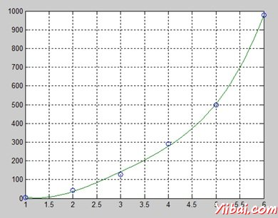

# MATLAB多项式 - Matlab教程

MATLAB指多项式行向量系数降幂排序。例如，方程 P(x) = x&lt;sup style="margin: 0px; padding: 0px; font-size: 13px;"&gt;4&lt;/sup&gt; + 7x&lt;sup style="margin: 0px; padding: 0px; font-size: 13px;"&gt;3&lt;/sup&gt; - 5x + 9 可以表示为：

p = [1 7 0 -5 9];

## 计算多项式

polyval 函数用于将指定的值 - 计算多项式。例如，要计算我们以前的多项式 **p**, x = 4, 输入:

```
p = [1 7 0  -5 9];
polyval(p,4)
```

MATLAB 执行上面的语句，并返回以下结果：

```
ans =
   693

```

MATLAB还提供了计算矩阵多项式polyvalm函数。矩阵多项式一个多项式矩阵变量。

例如，让我们创建一个正方形矩阵X 并计算多项式 p, 在 X:

```
p = [1 7 0  -5 9];
X = [1 2 -3 4; 2 -5 6 3; 3 1 0 2; 5 -7 3 8];
polyvalm(p, X)
```

MATLAB执行上面的语句，并返回以下结果：

```
ans =
        2307       -1769        -939        4499
        2314       -2376        -249        4695
        2256       -1892        -549        4310
        4570       -4532       -1062        9269

```

## 查找多项式的根

根函数计算多项式的根。例如，要计算多项式p，输入根：

```
p = [1 7 0  -5 9];
r = roots(p)
```

MATLAB执行上面的语句，并返回以下结果：

```
r =
  -6.8661 + 0.0000i
  -1.4247 + 0.0000i
   0.6454 + 0.7095i
   0.6454 - 0.7095i

```

poly 函数是根函数，并返回多项式的系数的倒数。例如：

```
p2 = poly(r)
```

MATLAB执行上面的语句，并返回以下结果：

```
p2 =
    1.0000    7.0000    0.0000   -5.0000    9.0000

```

## 多项式曲线拟合

polyfit 函数找到一个多项式的系数，适合采用最小二乘意义上的一组中的数据。如果x和y是两个向量含有的x和y被拟合数据的一个n次多项式，那么我们得到的多项式拟合的数据通过写入

```
p = polyfit(x,y,n)
```

## 例子

创建一个脚本文件，并键入下面的代码：

```
x = [1 2 3 4 5 6]; y = [5.5 43.1 128 290.7 498.4 978.67];  %data
p = polyfit(x,y,4)   %get the polynomial
% Compute the values of the polyfit estimate over a finer range, 
% and plot the estimate over the real data values for comparison:
x2 = 1:.1:6;          
y2 = polyval(p,x2);
plot(x,y,'o',x2,y2)
grid on
```

当运行该文件，MATLAB中显示以下结果：

```
p =
    4.1056  -47.9607  222.2598 -362.7453  191.1250

```

并绘制下图：

  