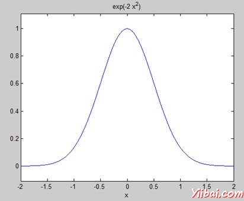

# MATLAB变换 - Matlab教程

MATLAB提供命令与转换，如拉普拉斯及傅立叶变换。变换被用来作为一种工具，用于简化数据从另一个角度分析在科学和工程。

例如，傅立叶变换，使我们能够表示为时间的函数的频率的函数的信号转换。拉普拉斯变换，使我们能够转换成差分方程的代数方程。

[MATLAB](http://www.yiibai.com/matlab)提供的拉普拉斯，傅立叶和FFT命令拉普拉斯，傅立叶和快速傅立叶变换工作。

## 拉普拉斯变换

时间函数f（t）的拉普拉斯变换的函数，由下式给出下面的积分：


拉普拉斯变换的变换函数f（t）也表示为F（次）。可以看到这种变换或一体化进程的符号变量t的函数，F（T），转换成另一个函数F（s）和另一个变量s。

拉普拉斯变换将微分方程转化为代数。要计算一个函数f（t）的拉普拉斯变换，这样写：

```
laplace(f(t))
```

## 示例

在这个例子中，我们会计算一些常用函数的拉普拉斯变换。

创建一个脚本文件，并键入下面的代码：

```
syms s t a b w
laplace(a)
laplace(t^2)
laplace(t^9)
laplace(exp(-b*t))
laplace(sin(w*t))
laplace(cos(w*t))
```

当运行该文件，它会显示以下结果：

```
ans =
 1/s^2

 ans =
 2/s^3

 ans =
 362880/s^10

 ans =
 1/(b + s)

ans =
 w/(s^2 + w^2)

ans =
 s/(s^2 + w^2)

```

## 逆拉普拉斯变换

MATLAB允许我们计算拉普拉斯逆变换使用命令ilaplace。

例如，

```
ilaplace(1/s^3)
```

MATLAB将执行上面的语句，并显示结果：

```
ans =
 t^2/2

```

## 例子

创建一个脚本文件，并键入下面的代码：

```
syms s t a b w
ilaplace(1/s^7)
ilaplace(2/(w+s))
ilaplace(s/(s^2+4))
ilaplace(exp(-b*t))
ilaplace(w/(s^2 + w^2))
ilaplace(s/(s^2 + w^2))
```

当运行该文件，它会显示以下结果：

```
ans =
t^6/720

 ans =
 2*exp(-t*w)

 ans =
 cos(2*t)

 ans =
 ilaplace(exp(-b*t), t, x)

 ans =
 sin(t*w)

 ans =
 cos(t*w)

```

## 傅立叶变换

傅立叶变换，常用的时间变换的数学函数，函数f（t），进入一个新的功能，有时记为或F组，其参数是频率与周期/秒（赫兹）或每秒弧度的单位。新的函数，然后被称为傅里叶变换和/或函数f的频谱。

## 例子

创建一个脚本文件，并键入下面的代码：

```
syms x 
f = exp(-2*x^2);  %our function
ezplot(f,[-2,2])  % plot of our function
FT = fourier(f)	% Fourier transform
```

当您运行该文件，MATLAB绘制如下图：



并显示以下结果：

```
FT =
 (2^(1/2)*pi^(1/2)*exp(-w^2/8))/2

```

折线图的傅里叶变换为：

```
ezplot(FT)
```

给出了如下图：


## 傅立叶逆变换

MATLAB提供的 ifourier 命令，用于计算一个函数的傅立叶逆变换。例如，

```
f = ifourier(-2*exp(-abs(w)))
```

MATLAB将执行上面的语句，并显示结果：

```
f =
-2/(pi*(x^2 + 1))
```

 