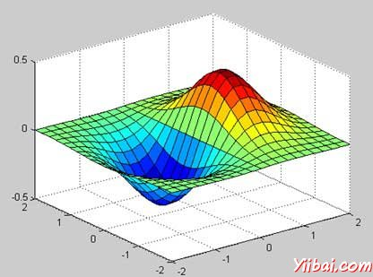
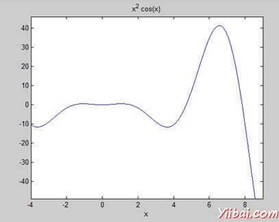

# MATLAB GNU Octave教程 - Matlab教程

GNU Octave是一种高级编程语言，像 MATLAB，它主要是用 [MATLAB](http://www.yiibai.com/matlab) 兼容。它也可以用来进行数值计算。

Octave 和 MATLAB具有以下共同特点：

*   矩阵的基本数据类型

*   它内置支持复数

*   它具有内置数学函数和库

*   它支持用户自定义功能

GNU Octave是自由可再分发的软件。您可以重新分配和/或修改它由自由软件基金会发布的GNU通用公共许可证（GPL）的条款下。

## MATLAB 和 Octave

大多数的MATLAB程序运行在Octave，但一些 Octave 程序可能无法正常运行，因为 Octave 允许一些语法而MATLAB却不支持。

例如，MATLAB只支持单引号，但的八音支持单，双引号来定义字符串。如果你正在寻找一个Octave教程，然后请去通过本教程从最初开始，涵盖了MATLAB以及Octave.

### 兼容的示例

本教程中涉及的几乎所有的例子都是用 MATLAB 以及 Octave 兼容。让我们试试下面的例子在 MATLAB 和 Octave，没有任何语法的变化产生相同的结果：

此示例创建一个3D表面地图函数 g = xe&lt;sup style="margin: 0px; padding: 0px; font-size: 13px;"&gt;-(x&lt;sup style="margin: 0px; padding: 0px; font-size: 13px;"&gt;2&lt;/sup&gt; + y&lt;sup style="margin: 0px; padding: 0px; font-size: 13px;"&gt;2&lt;/sup&gt;)&lt;/sup&gt;. 创建一个脚本文件，并键入下面的代码：

```
[x,y] = meshgrid(-2:.2:2);
g = x .* exp(-x.^2 - y.^2);
surf(x, y, g)
print -deps graph.eps
```

当您运行该文件，MATLAB显示下面的3-D地图：



### 不兼容的例子

虽然MATLAB的所有核心功能是可在 Octave 使用，也有一些功能，例如，微分和积分积分，这并不完全匹配，无论是语言。本教程试图给两种类型的例子，显示他们的语法不同。

请看下面的例子中 MATLAB 和 Octave 使不同功能的使用面积曲线： f(x) = x&lt;sup style="margin: 0px; padding: 0px; font-size: 13px;"&gt;2&lt;/sup&gt; cos(x) for −4 ≤ x ≤ 9\. 以下是MATLAB版本的代码：

```
f = x^2*cos(x);
ezplot(f, [-4,9])
a = int(f, -4, 9)
disp('Area: '), disp(double(a));
```

当运行该文件，MATLAB绘制图表：



并显示结果如下：

```
a =

8*cos(4) + 18*cos(9) + 14*sin(4) + 79*sin(9)

Area: 
    0.3326

```

面积在Octave相同的曲线，必须使用符号包如下：

```
pkg load symbolic
symbols

x = sym("x");

f = inline("x^2*cos(x)");

ezplot(f, [-4,9])
print -deps graph.eps

[a, ierror, nfneval] = quad(f, -4, 9);

display('Area: '), disp(double(a));
```

 