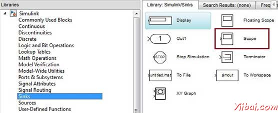

# MATLAB Simulink 仿真 - Matlab教程

Simulink 是一种动态和嵌入式系统，集成和 MATLAB 仿真和基于模型的设计环境。 Simulink 也 MathWorks 公司开发的，是一个数据流的图形化编程语言工具进行建模，模拟和分析多域的动态系统。它基本上是一个图形块图表工具，定制的集块库。

它可以让你将 MATLAB 算法模型，以及导出到MATLAB仿真结果作进一步分析。

Simulink支持：

*   系统级设计

*   模拟

*   自动代码生成

*   嵌入式系统的测试和验证

还有其他一些附加产品提供MathWorks和第三方硬件和软件产品，可用于Simulink。

以下列出了一些简要说明：

*   Stateflow 允许开发状态机器和流程图。

*   Simulink Coder 可以自动生成C源代码系统的实时实现。

*   xPC Target 可基于x86 实时系统提供了一个环境模拟和测试 Simulink 和 Stateflow 模型的实时物理系统上。

*   Embedded Coder 支持特定的嵌入式目标。

*   HDL Coder 允许自动生成可综合的VHDL和Verilog

*   SimEvents 提供了一个库的图形积木造型排队系统

Simulink是能够通过造型风格检查，要求可追溯性和模型覆盖分析模型系统的核查和验证。

Simulink设计验证，让您识别设计错误，并生成测试模型检查情况。

## 使用 Simulink

要打开Simulink，在MATLAB工作空间的类型：

```
simulink
```

Simulink使用库浏览打开。库浏览是用于建立仿真模型。


在左侧窗格中，你会发现几个库的基础上，各系统分类，点击每一个设计模块将显示在右侧的窗口窗格中。

## 建立模型

要创建一个新的模型库浏览的工具栏上，单击新建按钮。这将打开一个新的未命名的示范窗口


Simulink 模型的框图。

模型元素的加入，通过选择适当的元素从“库”浏览器，并将其拖动到模型窗口。

或者，您可以复制​​模型元素，将它们粘贴到模型窗口。

## 例子

从Simulink库中的拖放到你的项目。

如果在本实施例的目的，2块将被用于模拟 - 源（信号）和一个接收器（范围）。信号发生器（源）产生模拟信号，然后将图形可视化的范围（片）。


首先从库中所需的块拖动到项目窗口。然后，块连接在一起，可以通过拖动一个街区到另一个连接点连接器。

让我们“正弦波”拖动到模型块。


选择'Sinks'从库中拖出一个“Scope”到模型块。



将信号线从的输出正弦波块，范围块的输入。


运行仿真按下“Run”按钮，所有参数保持默认（从模拟菜单中，您可以更改它们）

应该得到的范围，从下面的图。

  