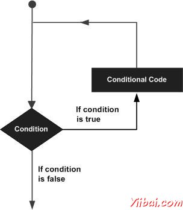

# Objective-C 循环 - Objective-C教程

可能存在这样的情况，当需要执行的代码块多次。在一般情况下，语句执行顺序：先在一个函数中的第一条语句执行，其次第二，等等。

编程语言都提供了各种控制结构，允许更复杂的执行路径。

循环语句允许我们执行一个语句或语句组多次，下面是在大多数编程语言中的循环语句的一般形式：



Objective-C编程语言提供了以下类型的循环处理循环的需求。点击以下链接，查看他们的详细资料。

| Loop Type | 描述 |
| --- | --- |
| [while 循环](http://www.yiibai.com/objective_c/objective_c_while_loop.html "while loop in Objective-C") | 一个给定的条件为真时，重复执行一个语句或语句组。执行循环体测试前的状态. |
| [for 循环](http://www.yiibai.com/objective_c/objective_c_for_loop.html "for loop in Objective-C") | 执行的语句序列多次缩写的代码管理循环变量. |
| [do...while 循环](http://www.yiibai.com/objective_c/objective_c_do_while_loop.html "do...while loop in Objective-C") | while语句一样，只不过它在循环体结束测试条件. |
| [内嵌循环](http://www.yiibai.com/objective_c/objective_c_nested_loops.html "nested loops in Objective-C") | 可以使用任何其他一个或多个循环 while, for or do..while 循环. |

## 循环控制语句：

循环控制语句更改执行其正常的顺序。当执行离开范围，在该范围内所有自动创建的对象被销毁。

Objective-C的支持下控制语句。点击以下链接，查看他们的详细资料。

| 控制语句 | 描述 |
| --- | --- |
| [break 语句](http://www.yiibai.com/objective_c/objective_c_break_statement.html "break statement in Objective-C") | 终止循环或开关语句将执行的语句紧随循环或开关。 |
| [continue 语句](http://www.yiibai.com/objective_c/objective_c_continue_statement.html "continue statement in Objective-C") | 导致循环，跳过它的主体的其余部分，并立即重新测试前的重申状况。 |

## 无限循环：

一个循环变得无限循环，如果条件永远不会成为假。在for循环是传统上用于此目的。由于没有形成循环的三个表达式是必需的，可以做一个无限循环，离开的条件表达式为空。

```
#import <Foundation/Foundation.h>

int main ()
{

   for( ; ; )
   {
      NSLog(@"This loop will run forever.
");
   }

   return 0;
}
```

当条件表达式不存在，它被假定为是真实的。可能有一个初始化和增量表达，但更普遍使用的Objective-C程序 for(;;) 结构来表示一个无限循环。

 