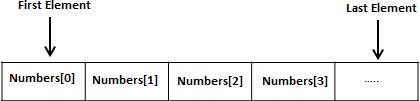

# Objective-C Arrays/数组 - Objective-C教程

Objective-C编程语言提供了一个数据结构被称为数组，它可以存储一个固定大小的相同类型的元素的有序集合。一个数组用于存储的数据的集合，但它往往是比较有用的，想到的一个数组作为相同类型的变量的集合。

声明个别变量，如 number0, number1, ..., 和 number99，而是声明一个数组变量，如数字和使用numbers[0], numbers[1], 和..., numbers[99]代表单个变量。一个特定的索引访问数组中的元素。

所有的数组由连续的内存位置。最低的地址对应的第一个元素到最后一个元素的最高地址。



## 声明数组

在Objective-C中声明数组，程序员指定的元素类型和所需元素的数组数如下：

```
type arrayName [ arraySize ];
```

这就是所谓的一维数组。arraySize 必须是一个整数常量大于零，类型可以是任何有效的Objective-C的数据类型。例如，声明一个10个元素的数组称为balance 类型为 double，使用下面的语句：

```
double balance[10];
```

现在，balance 是一个数组变量，这是足以容纳10个双精度数。

## 初始化数组

可以初始化数组在Objective-C中，无论是由一个或使用一个单独的语句如下：

```
double balance[5] = {1000.0, 2.0, 3.4, 17.0, 50.0};
```

大括号{}之间的值不能大于我们声明的方括号[]数组的元素个数。下面是一个例子，指定单个元素的数组：

如果省略数组的大小，大到足以容纳初始化数组创建。因此，如果写：

```
double balance[] = {1000.0, 2.0, 3.4, 17.0, 50.0};
```

像上面所做一样，在前面的例子中，将创建完全相同的数组。

```
balance[4] = 50.0;
```

上面的语句分配数组中的值50.0第5元素个数。他们的第一个元素的索引，这也被称为基本索引为0，数组第4个索引为第5个数，即最后一个元素。以下是我们上面所讨论画面表示相同的数组：


## 访问数组元素

元素访问通过索引数组名。这是通过放置元素的索引数组名后的括号内。例如：

```
double salary = balance[9];
```

上面的语句将取第10个元素，从数组中指定salary变量的值。下面是一个例子，这将使用所有上述三个概念，即。声明，赋值和访问数组：

```
#import <Foundation/Foundation.h>

int main ()
{
   int n[ 10 ]; /* n is an array of 10 integers */
   int i,j;

   /* initialize elements of array n to 0 */         
   for ( i = 0; i < 10; i++ )
   {
      n[ i ] = i + 100; /* set element at location i to i + 100 */
   }

   /* output each array element's value */
   for (j = 0; j < 10; j++ )
   {
      NSLog(@"Element[%d] = %d
", j, n[j] );
   }

   return 0;
}
```

让我们编译和运行上面的程序，这将产生以下结果：

```
2013-09-14 01:24:06.669 demo[16508] Element[0] = 100
2013-09-14 01:24:06.669 demo[16508] Element[1] = 101
2013-09-14 01:24:06.669 demo[16508] Element[2] = 102
2013-09-14 01:24:06.669 demo[16508] Element[3] = 103
2013-09-14 01:24:06.669 demo[16508] Element[4] = 104
2013-09-14 01:24:06.669 demo[16508] Element[5] = 105
2013-09-14 01:24:06.669 demo[16508] Element[6] = 106
2013-09-14 01:24:06.669 demo[16508] Element[7] = 107
2013-09-14 01:24:06.669 demo[16508] Element[8] = 108
2013-09-14 01:24:06.669 demo[16508] Element[9] = 109

```

## Objective-C语言中的数组详细

数组是Objective-C中重要的部分，并需要大量的详细信息。有以下几个重要概念相关的Objective-C语言的程序员应该清楚数组用法：

| 概念 | 描述 |
| --- | --- |
| [多维数组](http://www.yiibai.com/objective_c/objective_c_multi_dimensional_arrays.html "Multi-dimensional arrays in Objective-C") | Objective-C的支持多维数组。多维数组的最简单形式是二维数组。 |
| [向函数传递数组](http://www.yiibai.com/objective_c/objective_c_passing_arrays_to_functions.html "Passing arrays to functions as arguments in Objective-C") | 可以传递给函数的指针到一个数组中没有索引指定数组的名字。 |
| [从函数返回数组](http://www.yiibai.com/objective_c/objective_c_return_arrays_from_function.html "Return array from function in Objective-C") | Objective-C中允许一个函数返回一个数组。 |
| [指向数组的指针](http://www.yiibai.com/objective_c/objective_c_yiibaier_to_an_array.html "Yiibaier to an array in Objective-C") | 可以生成一个简单的通过指定数组名数组的第一个元素的指针，没有任何索引。 |

 