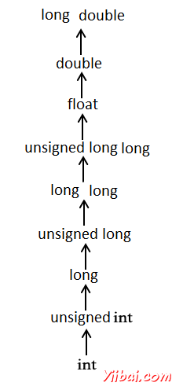

# Objective-C 类型转换 - Objective-C教程

转换类型是一种变量从一种数据类型转换为另一种数据类型。例如，如果想存储一个long值转换成一个简单的整数，那么可以键入转换long 的int类型。可以将值从一个类型到另一个显式地使用转换运算符如下：

```
(type_name) expression
```

Objective-C中，我们一般使用的CGFloat 做浮点运算，该类派生自基本类型。浮点值在32位和双64位的情况下。请看下面的例子浮点运算要执行一个整型变量除法由另一转换运算符：

```
#import <Foundation/Foundation.h>

int main()
{
   int sum = 17, count = 5;
   CGFloat mean;

   mean = (CGFloat) sum / count;
   NSLog(@"Value of mean : %f
", mean );

   return 0;
}
```

上面的代码编译和执行时，它会产生以下结果：

```
2013-09-11 01:35:40.047 demo[20634] Value of mean : 3.400000

```

应该指出的是，转换运算符的优先级高于除法，这样值的总和首先转换为double型最后它就会产生一个double值除以计数。

类型转换可以是隐式的，这是由编译器执行自动或通过使用转换运算符，它可以显式地指定。类型转换时使用转换运算符是必要的，它被认为是良好的编程习惯。

## 整数推进提升

整型提升的过程，“小于”int或unsigned int整数类型的值转换为int或unsigned int。考虑加入一个字符在int 的一个例子：

```
#import <Foundation/Foundation.h>

int main()
{
   int  i = 17;
   char c = 'c'; /* ascii value is 99 */
   int sum;

   sum = i + c;
   NSLog(@"Value of sum : %d
", sum );

   return 0;
}
```

上面的代码编译和执行时，它会产生以下结果：

```
2013-09-11 01:38:28.492 demo[980] Value of sum : 116

```

在这里值的总和为116，因为编译器正在做整型提升和转换'c'的ASCII值，然后再执行实际的加法运算。

## 正常的算术转换

通常的算术转换隐式执行投下自己的值，在一个共同的类型。编译器首先进行整型提升，如果操作数仍然有不同的类型，然后它们被转换为类型出现在以下层次最高：



通常的算术转换不进行赋值运算符，也不是逻辑运算符&&和| |。让我们看看下面的例子来理解这个概念：

```
#import <Foundation/Foundation.h>

int main()
{
   int  i = 17;
   char c = 'c'; /* ascii value is 99 */
   CGFloat sum;

   sum = i + c;
   NSLog(@"Value of sum : %f
", sum );
   return 0;
}
```

上面的代码编译和执行时，它会产生以下结果：

```
2013-09-11 01:41:39.192 demo[15351] Value of sum : 116.000000

```

在这里，它是简单把第一个c被转换成整数，但因为终值是float，所以通常的算术转换适用于I和C编译器转换成float，并添加他们产生了float结果。

 