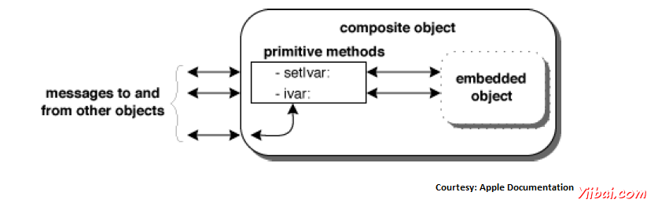

# Objective-C 复合对象 - Objective-C教程

我们可以创建子类簇内嵌入对象定义了一个类。这些类对象是复合对象。

所以，你可能会想知道什么是类簇。所以我们会先看看什么是类簇。

## 类簇

类簇是Foundation框架的设计模式，使用了大量的。类簇群的一些私有的具体子类下一个公共的抽象父类。在这样的类分组，简化公开可见的一个面向对象的框架结构，而不降低其功能丰富。类集群的基础上抽象工厂设计模式。

为了简单，而不是创建多个类似函数的类，我们创建了一个类，其处理的基础上处理输入的值。

例如，在 NSNumber有许多簇类，如字符型，整型，布尔等。我们组合所有这些到一个单一的，负责处理类似的操作在一个类中的类。NSNumber 实际上这些原始类型到对象封装的值。

## 那么什么是完全相同复合对象？

私有集群对象嵌入在我们自己设计的对象，我们创建一个复合对象。这种复合对象可以依靠其基本功能的群集对象，只拦截消息，希望在某些特定的方式处理复合对象。这种结构减少了我们必须编写的代码量，可利用基础框架所提供的测试代码。

下图对此进行了解释。



复合对象必须声明自己是一个集群的抽象父类的子类。作为一个子类，它必须覆盖父类的原始方法。它也可以重写派生的方法，但这不是必需的，因为派生的方法通过原语工作。

NSArray类的计数方法是一个例子，它覆盖的方法可以干预对象的实现也很简单，如：

```
- (unsigned)count 
{
return [embeddedObject count];
}
```

在上面的例子中，嵌入的对象实际上是类型的NSArray。

## 一个复合对象的例子

现在，为了看到一个完整的例子，让我们来看看下面给出的例子来自苹果的文档。

```
#import <Foundation/Foundation.h>

@interface ValidatingArray : NSMutableArray
{
    NSMutableArray *embeddedArray;
}

+ validatingArray;
- init;
- (unsigned)count;
- objectAtIndex:(unsigned)index;
- (void)addObject:object;
- (void)replaceObjectAtIndex:(unsigned)index withObject:object;
- (void)removeLastObject;
- (void)insertObject:object atIndex:(unsigned)index;
- (void)removeObjectAtIndex:(unsigned)index;

@end

@implementation ValidatingArray
- init
{
   self = [super init];
   if (self) {
      embeddedArray = [[NSMutableArray allocWithZone:[self zone]] init];
   }
   return self;
}

+ validatingArray
{
   return [[self alloc] init] ;
}
- (unsigned)count
{
   return [embeddedArray count];
}
- objectAtIndex:(unsigned)index
{
    return [embeddedArray objectAtIndex:index];
}
- (void)addObject:(id)object
{
   if (object != nil) {
      [embeddedArray addObject:object];
   }
}
- (void)replaceObjectAtIndex:(unsigned)index withObject:(id)object;
{
   if (index <[embeddedArray count] && object != nil) {
       [embeddedArray replaceObjectAtIndex:index withObject:object];
   }
}
- (void)removeLastObject;
{
   if ([embeddedArray count] > 0) {
       [embeddedArray removeLastObject];
   }
}
- (void)insertObject:(id)object atIndex:(unsigned)index;
{
   if (object != nil) {
       [embeddedArray insertObject:object atIndex:index];
   }
}
- (void)removeObjectAtIndex:(unsigned)index;
{
   if (index <[embeddedArray count]) {
       [embeddedArray removeObjectAtIndex:index];
   }
}

@end

int main()
{
   NSAutoreleasePool * pool = [[NSAutoreleasePool alloc] init];
   ValidatingArray *validatingArray = [ValidatingArray validatingArray];
   [validatingArray addObject:@"Object1"];
   [validatingArray addObject:@"Object2"];
   [validatingArray addObject:[NSNull null]];
   [validatingArray removeObjectAtIndex:2];
   NSString *aString = [validatingArray objectAtIndex:1];
   NSLog(@"The value at Index 1 is %@",aString);
   [pool drain];
   return 0;
}
```

现在，当我们编译并运行程序，我们会得到以下的结果。

```
2013-09-28 22:03:54.294 demo[6247] The value at Index 1 is Object2
```

在上面的例子中，我们可以看到验证数组的一个函数，也不允许添加空对象，这将导致在正常的情况下崩溃。但是，我们的验证数组需要处理好它。类似地，每个验证数组中的方法以及验证过程从正常的操作顺序分开。

