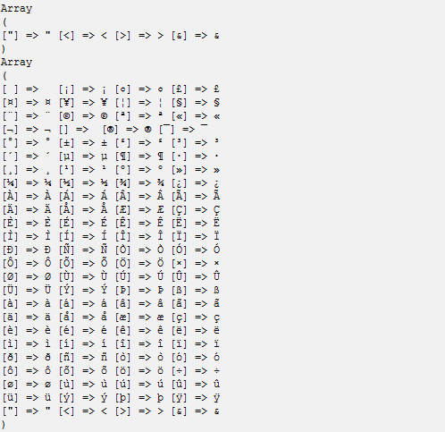

# PHP get_html_translation_table() 函数


## 定义和用法

get_html_translation_table() 函数返回被 [htmlentities()](/php/func_string_htmlentities.asp "PHP htmlentities() 函数") 和 [htmlspecialchars()](/php/func_string_htmlspecialchars.asp "PHP htmlspecialchars() 函数") 函数使用的翻译表。

### 语法

```
get_html_translation_table(function,quotestyle)
```

| 参数 | 描述 |
| --- | --- |
| function | 可选。规定返回哪个翻译表。默认是 HTML_SPECIALCHARS。可能的值：   `HTML_ENTITIES` - 翻译所有需要 URL 编码的字符，以便正确地显示在网页上。   `HTML_SPECIALCHARS` - 翻译某些需要 URL 编码的字符，以便正确地显示在网页上。 |
| salt | 可选。定义如何对单引号和双引号进行编码。默认是 ENT_COMPAT。可能的值：   `ENT_COMPAT` - 编码双引号，不编码单引号。   `ENT_QUOTES` - 编码双引号和单引号。   `ENT_NOQUOTES` - 不编码单引号或双引号。 |

### 说明

## 提示和注释

提示：一些字符可以按照若干种方式进行编码。get_html_translation_table() 返回最普通的编码。

## 例子

在本例中，我们将展示两种翻译表：

```
<?php
print_r (get_html_translation_table());
echo "<br />";
print_r (get_html_translation_table(HTML_ENTITIES));
?>
```

输出：


