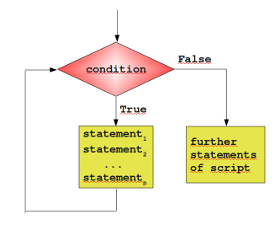

# Python 循环

本章节将为大家介绍Python循环语句的使用。

Python中的循环语句有 for 和 while。

Python循环语句的控制结构图如下所示：



## while 循环

Python中while语句的一般形式：

```
while 判断条件：
    statements

```

同样需要注意冒号和缩进。另外，在Python中没有do..while循环。

以下实例使用了 while 来计算 1 到 100 的总和：

```
#!/usr/bin/env python3

n = 100

sum = 0
counter = 1
while counter <= n:
    sum = sum + counter
    counter += 1

print("Sum of 1 until %d: %d" % (n,sum))

```

执行结果如下：

```
Sum of 1 until 100: 5050

```

## for语句

Python for循环可以遍历任何序列的项目，如一个列表或者一个字符串。

for循环的一般格式如下：

```
for <variable> in <sequence>:
	<statements>
else:
	<statements>

```

Python loop循环实例：

```
>>> languages = ["C", "C++", "Perl", "Python"] 
>>> for x in languages:
...     print x
... 
C
C++
Perl
Python
>>> 

```

以下实例for实例中使用了 break语句，break语句用于跳出当前循环体：

```
#!/usr/bin/env python3
edibles = ["ham", "spam","eggs","nuts"]
for food in edibles:
    if food == "spam":
        print("No more spam please!")
        break
    print("Great, delicious " + food)
else:
    print("I am so glad: No spam!")
print("Finally, I finished stuffing myself")

```

执行脚本后，在循环到 "spam"时会跳出循环体：

```
Great, delicious ham
No more spam please!
Finally, I finished stuffing myself

```

## range()函数

如果你需要遍历数字序列，可以使用内置range()函数。它会生成数列，例如:

```
>>> for i in range(5):
...     print(i)
...
0
1
2
3
4

```

你也可以使用range指定区间的值：

```
>>> for i in range(5,9) :
	print(i)

5
6
7
8
>>>

```

也可以使range以指定数字开始并指定不同的增量(甚至可以是负数;有时这也叫做'步长'):

```
>>> for i in range(0, 10, 3) :
	print(i)

0
3
6
9
>>> 

```

负数：

```
>>> for i in range(-10, -100, -30) :
	print(i)

-10
-40
-70
>>> 

```

您可以结合range()和len()函数以遍历一个序列的索引,如下所示:

```
>>> a = ['Mary', 'had', 'a', 'little', 'lamb']
>>> for i in range(len(a)):
...     print(i, a[i])
...
0 Mary
1 had
2 a
3 little
4 lamb

```

还可以使用range()函数来创建一个列表：

```
>>> list(range(5))
[0, 1, 2, 3, 4]
>>>

```

## break和continue语句及循环中的else子句

break语句可以跳出for和while的循环体。如果你从for或while循环中终止，任何对应的循环else块将不执行。

continue语句被用来告诉Python跳过当前循环块中的剩余语句，然后继续进行下一轮循环。

循环语句可以有else子句;它在穷尽列表(以for循环)或条件变为假(以while循环)循环终止时被执行,但循环被break终止时不执行.如下查寻质数的循环例子:

```
>>> for n in range(2, 10):
...     for x in range(2, n):
...         if n % x == 0:
...             print(n, 'equals', x, '*', n//x)
...             break
...     else:
...         # 循环中没有找到元素
...         print(n, 'is a prime number')
...
2 is a prime number
3 is a prime number
4 equals 2 * 2
5 is a prime number
6 equals 2 * 3
7 is a prime number
8 equals 2 * 4
9 equals 3 * 3

```

## pass语句

pass语句什么都不做。它只在语法上需要一条语句但程序不需要任何操作时使用.例如:

```
>>> while True:
...     pass  # 等待键盘中断 (Ctrl+C)

```

最小的类:

```
>>> class MyEmptyClass:
...     pass

```

