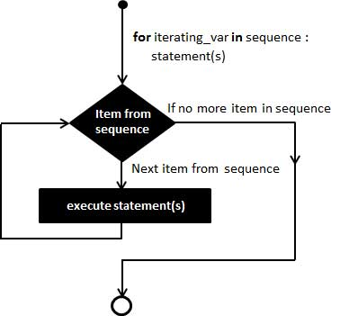

# Python for 循环语句

Python for循环可以遍历任何序列的项目，如一个列表或者一个字符串。

**语法：**

for循环的语法格式如下：

```
for iterating_var in sequence:
   statements(s)

```

**流程图：**



**实例：**

```
#!/usr/bin/python

for letter in 'Python':     # First Example
   print 'Current Letter :', letter

fruits = ['banana', 'apple',  'mango']
for fruit in fruits:        # Second Example
   print 'Current fruit :', fruit

print "Good bye!"

```

以上实例输出结果:

```
Current Letter : P
Current Letter : y
Current Letter : t
Current Letter : h
Current Letter : o
Current Letter : n
Current fruit : banana
Current fruit : apple
Current fruit : mango
Good bye!

```

## 通过序列索引迭代

另外一种执行循环的遍历方式是通过索引，如下实例：

```
#!/usr/bin/python

fruits = ['banana', 'apple',  'mango']
for index in range(len(fruits)):
   print 'Current fruit :', fruits[index]

print "Good bye!"

```

以上实例输出结果：

```
Current fruit : banana
Current fruit : apple
Current fruit : mango
Good bye!

```

以上实例我们使用了内置函数 len() 和 range(),函数 len() 返回列表的长度，即元素的个数。 range返回一个序列的数。

## 循环使用 else 语句

在 python 中，for … else 表示这样的意思，for 中的语句和普通的没有区别，else 中的语句会在循环正常执行完（即 for 不是通过 break 跳出而中断的）的情况下执行，while … else 也是一样。

如下实例：

```
#!/usr/bin/python

for num in range(10,20):  #to iterate between 10 to 20
   for i in range(2,num): #to iterate on the factors of the number
      if num%i == 0:      #to determine the first factor
         j=num/i          #to calculate the second factor
         print '%d equals %d * %d' % (num,i,j)
         break #to move to the next number, the #first FOR
   else:                  # else part of the loop
      print num, 'is a prime number'

```

以上实例输出结果：

```
10 equals 2 * 5
11 is a prime number
12 equals 2 * 6
13 is a prime number
14 equals 2 * 7
15 equals 3 * 5
16 equals 2 * 8
17 is a prime number
18 equals 2 * 9
19 is a prime number

```

