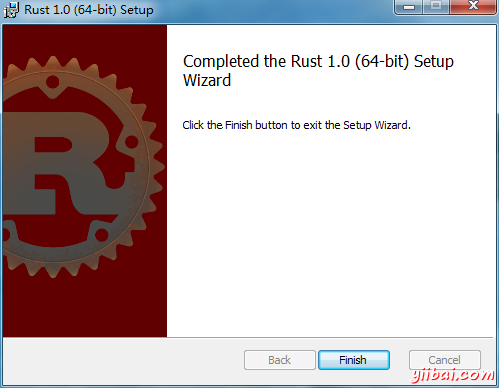

# Rust下载和安装 - Rust教程

### 1、在Linux和Mac上安装Rust：

在Linux和Mac上安装Rust(稳定的二进制)的一个简单的方法，只需要在shell中运行以下命令：

```
$ curl -sSf https://static.rust-lang.org/rustup.sh | sh
```

一个简单的方法来安装测试版二进制的Rust在Linux和Mac上，只需要在shell中运行这个：

```
$ curl -sSf https://static.rust-lang.org/rustup.sh | sh -s -- --channel=beta
```

一个简单的方法来安装Rust的二进制在Linux和Mac上，只需要在shell中运行这个命令：

```
$ curl -sSf https://static.rust-lang.org/rustup.sh | sh -s -- --channel=nightly
```

### 2、在Windows上安装Rust：

请访问以下网址：http://www.rust-lang.org/ ，并下载 [rust-1.0.0-x86_64-pc-windows-gnu.msi](https://static.rust-lang.org/dist/rust-1.0.0-x86_64-pc-windows-gnu.msi) 安装过程参考以下： 第一步：  第二步：选择一个位置  第三步：选择安装功能选项  第四步：安装完成  到这里整个安装过程完成！如果有问题可以参考官方的说明。 官方参考：[http://www.rust-lang.org/install.html](http://www.rust-lang.org/install.html)   