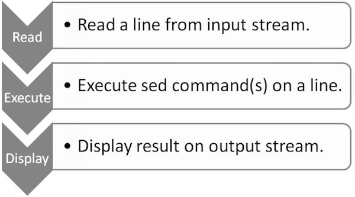

# sed工作流程 - Sed教程

本章将解释sed究竟如何工作的。要成为一个专家级的sed用户，需要知道它的内部执行和结构。sed遵循一个简单的工作流：读取，执行和显示。下图描绘了工作流程。



## 读取

sed从输入流(文件，管道，或标准输入)读取，并将其存储在其内部的缓冲模式称为缓冲行。

## 执行

所有sed命令顺序地对模式缓冲区使用。默认情况下，sed命令都适用于所有行(全局)，除非指定行寻址。

## 显示

sed发送(修改)的内容到输出数据流。在发送数据后，模式缓冲器是空的。这个过程一直重复，直到文件被耗尽。

### 示例

让我们创建一个文本文件quote.txt包含引用著名作家Paulo Coelho。

```
[jerry]$ vi quote.txt 
There is only one thing that makes a dream impossible to achieve: the fear of failure. 
 - Paulo Coelho, The Alchemist

```

为了了解sed的工作流程，让我们使用sed显示该文件的内容quote.txt。这个例子模仿cat命令。

```
[jerry]$ sed '' quote.txt

```

当执行上面的代码，就会产生下面的结果。

```
There is only one thing that makes a dream impossible to achieve: the fear of failure. 

```

在上面的例子中，quote.txt输入文件名和在此之前，有一对单引号的暗示sed 命令。让我们解读此操作。

第一sed从输入文件quote.txt读取并将其存储在它的模式缓冲区行。然后它适用sed关于模型缓冲区命令。在我们的例子中没有sed 命令在那里，因此是对模式缓冲区未进行任何操作。最后删除，并打印在标准输出模式缓冲区中的内容。是不是很简单？

在下面的例子中，sed 接受来自标准输入流输入。

```
[jerry]$ sed '' 
```

当执行上面的代码，它会提示我们输入从标准输入一些文字。因此，让我们进入一个文本行，如下所示：

```
There is only one thing that makes a dream impossible to achieve: the fear of failure. 

```

输入该行后，当我们按下输入产生以下结果：

```
There is only one thing that makes a dream impossible to achieve: the fear of failure.

```

要从使用的sed会话退出，按下键盘上的 ctrl-D (^D).

 