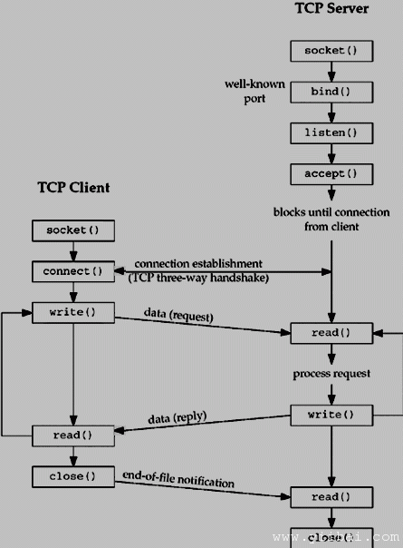

# Socket 核心函数 - Socket编程


本教程将介绍写一个完整的TCP客户端和服务器需要的套接字核心函数。

以下是完整的客户端和服务器的交互图：



## _socket_ 函数:

要执行网络I/O，进程必须做的第一件事是调用socket函数，指定所需的通信协议类型和协议族等。


```
#include &lt;sys/types.h&gt;
#include &lt;sys/socket.h&gt;

int socket (int family, int type, int protocol);

```


这个调用给一个套接字描述符，可以用在以后的系统调用，-1为出错。

## 参数:

**协议族:** 指定协议族，是一个常量如下所示：

| Family | 描述 |
| --- | --- |
| AF_INET | IPv4 protocols |
| AF_INET6 | IPv6 protocols |
| AF_LOCAL | Unix domain protocols |
| AF_ROUTE | Routing Sockets |
| AF_KEY | Ket socket |

本教程不谈论除IPv4协议之外的其他协议。

**类型:** 指定类想要的套接字。它可以取下列值之一：

| 类型 | 描述 |
| --- | --- |
| SOCK_STREAM | Stream socket |
| SOCK_DGRAM | Datagram socket |
| SOCK_SEQPACKET | Sequenced packet socket |
| SOCK_RAW | Raw socket |

**协议:** 参数应设置具体的协议类型如下，或低于0的系统的默认值：

| 协议 | 描述 |
| --- | --- |
| IPPROTO_TCP | TCP transport protocol |
| IPPROTO_UDP | UDP transport protocol |
| IPPROTO_SCTP | SCTP transport protocol |

## _connect_ 函数:

connect函数使用一个TCP客户端，TCP服务器建立连接。


```
#include &lt;sys/types.h&gt;
#include &lt;sys/socket.h&gt;

int connect(int sockfd, struct sockaddr *serv_addr, int addrlen);

```


这个调用返回0，则它成功地连接到服务器，否则它给-1的错误。

## 参数:

*   **sockfd:** socket函数返回一个套接字描述符.

*   **serv_addr** 是一个指向struct sockaddr的包含目的IP地址和端口.

*   **addrlen** 设置sizeof为(struct sockaddr).

## _bind_ 函数:

分配一个本地协议地址绑定功能的套接字。与互联网协议的协议地址是一个32位的IPv4地址或128比特的IPv6地址的组合，以及与一个16-bit的TCP或UDP端口号。仅由TCP服务器调用此函数。


```
#include &lt;sys/types.h&gt;
#include &lt;sys/socket.h&gt;

int bind(int sockfd, struct sockaddr *my_addr,int addrlen);

```


这个调用返回0，则表示它成功绑定的地址，否则它给-1的错误。

## 参数:

*   **sockfd:** 是socket函数返回一个套接字描述符。

*   **my_addr** 是一个指向struct sockaddr的包含本地IP地址和端口。

*   **addrlen** 设置sizeof为(struct sockaddr).

可以把IP地址和端口自动设置：

端口号0值意味着系统将随机选择一个端口和IP地址INADDR_ANY值是指服务器的IP地址将被自动分配。


```
server.sin_port = 0;  		     
server.sin_addr.s_addr = INADDR_ANY;

```


**注:** 不伦不类的端口和服务的教程，所有端口小于1024被保留。所以，可以设置1024以上的端口（但小于65535），同时设置端口不能正在被其他程序使用。

## _listen_ 函数:

监听listen函数被调用时，只能由一个TCP服务器，它执行两个动作:

*   监听函数将陷入被动套接字未连接的套接字，表明内核应该接受传入的连接请求定向到该套接字。

*   这个函数的第二个参数指定连接的内核应此套接字队列的最大数目。


```
#include &lt;sys/types.h&gt;
#include &lt;sys/socket.h&gt;

int listen(int sockfd,int backlog);

```


这个调用成功返回0，否则它返回-1的错误。

## 参数:

*   **sockfd:** socket函数返回一个套接字描述符。

*   **backlog** 允许的连接数。

## _accept_ 函数:

由TCP服务器调用accept函数返回下一个已完成连接，从完整的连接队列的前面。以下是调用的签名：


```
#include &lt;sys/types.h&gt;
#include &lt;sys/socket.h&gt;

int accept (int sockfd, struct sockaddr *cliaddr, socklen_t *addrlen);

```


这个调用返回非负描述符成功，否则 -1 为出错。返回的描述符被假定为一个客户端的套接字描述符，描述的所有读写操作的工作在客户端通信。

## 参数:

*   **sockfd:** socket函数返回一个套接字描述符。

*   **cliaddr** 是一个指向struct sockaddr，包含客户端的IP地址和端口。

*   **addrlen** 它设置于sizeof(struct sockaddr).

## _send_ 函数:

发送功能是用来发送数据流套接字或连接的数据报套接字。如果想在未连接的数据报套接字发送数据，必须使用sendto()函数。

可以使用write()系统调用发送数据。此调用解释在辅助功能的教程。


```
int send(int sockfd, const void *msg, int len, int flags);

```


这个调用返回发送出去的字节数，否则将返回-1错误.

## 参数:

*   **sockfd:** 是socket函数返回一个套接字描述符。

*   **msg** 要发送的数据是一个指针。

*   **len** 是要发送的数据（以字节为单位）长度。

*   **flags** 设置为 0.

## _recv_ 函数:

recv函数是用来接收数据流套接字或连接数据报套接字。如果想在未连接的数据报套接字接收数据，必须使用recvfrom()函数。.

可以使用_read()_系统调用来读取数据。此调用解释在辅助功能的教程。


```
int recv(int sockfd, void *buf, int len, unsigned int flags);

```


这个调用返回读入缓冲区的字节数，否则将返回-1错误。

## 参数:

*   **sockfd:** socket函数返回一个套接字描述符。

*   **buf** 缓冲区读取信息。

*   **len** 最大的缓冲区的长度。

*   **flags** 设置为 0.

## _sendto_ 函数:

sendto函数用于未连接的数据报套接字发送数据。简单地说，当使用SCOKET类型为SOCK_DGRAM


```
int sendto(int sockfd, const void *msg, int len, unsigned int flags,
		   const struct sockaddr *to, int tolen);

```


这个调用返回发送的字节数否则将返回-1错误。

## 参数:

*   **sockfd:** socket函数返回一个套接字描述符。

*   **msg **要发送的数据是一个指针。

*   **len** 是要发送的数据（以字节为单位）的长度。

*   **flags** 设置为 0.

*   **to** 是一个指向结构sockaddr的主机要发送数据。

*   **tolen** is set it to sizeof(struct sockaddr).

## _recvfrom_ 函数:

recvfrom函数用于未连接的数据报套接字接收数据。简单地说，当使用SCOKET类型为SOCK_DGRAM时适用。


```
int recvfrom(int sockfd, void *buf, int len, unsigned int flags
		     struct sockaddr *from, int *fromlen);

```


这个调用返回读入缓冲区的字节数，否则将返回-1错误。

## 参数:

*   **sockfd:** socket函数返回一个套接字描述符。

*   **buf** 缓冲区读取信息。

*   **len** 最大的缓冲区的长度。

*   **flags** 被设置为0。

*   **from** 是一个指向结构sockaddr的数据的主机被读取。

*   **fromlen** 设置为sizeof(struct sockaddr)

## _close_ 函数:

close函数是用来关闭客户端和服务器之间的通信。


```
int close( int sockfd );

```


这个调用成功返回0，否则返回-1错误。

## 参数:

*   **sockfd:** socket函数返回一个套接字描述符。

## _shutdown_ 函数:

_shutdown_函数用于正常关闭客户端和服务器之间的通信。此函数提供了更多的控制在比较_close_函数。


```
int shutdown(int sockfd, int how);

```


这个调用成功返回0，否则返回-1错误。

## 参数:

*   **sockfd:** socket函数返回一个套接字描述符。

*   **how:** 放入一个数字：

    *   **0** 表示接收不允许的，

    *   **1** 表明发送不允许

    *   **2** 表明禁止发送和接收。如果设置为2，它与close()同样。

## _select_ 函数:

select函数显示指定文件的描述符是以待准备就绪读取，准备写入或有一个错误条件。

当应用程序调用recv或recvfrom被阻塞，直到数据到达该套接字。一个应用程序可以做其他有用的处理，而输入的数据流是空的。另一种情况是，当应用程序从多个套接字接收数据。

调用recv或recvfrom防止立即接收数据与其他Socket上，它的输入队列中没有数据。 select函数调用来解决这个问题，允许程序轮询所有的套接字手柄，看看他们是否有无阻塞读取和写入操作。


```
 int select(int  nfds,  fd_set  *readfds,  fd_set  *writefds,
     fd_set *errorfds, struct timeval *timeout);

```


这个调用成功返回0，否则返回-1错误。

## 参数:

*   **nfds:** specifies the range of file descriptors to be tested. The select() function tests file descriptors in the range of 0 to nfds-1

*   **readfds:**points to an object of type _fd_set_ that on input specifies the file descriptors to be checked for being ready to read, and on output indicates which file descriptors are ready to read. Can be NULL to indicate an empty set.

*   **writefds:**points to an object of type _fd_set_ that on input specifies the file descriptors to be checked for being ready to write, and on output indicates which file descriptors are ready to write Can be NULL to indicate an empty set.

*   **exceptfds :**points to an object of type _fd_set_ that on input specifies the file descriptors to be checked for error conditions pending, and on output indicates which file descriptors have error conditions pending. Can be NULL to indicate an empty set.

*   **timeout :**poins to a timeval struct that specifies how long the select call should poll the descriptors for an available I/O operation. If the timeout value is 0, then select will return immediately. If the timeout argument is NULL, then select will block until at least one file/socket handle is ready for an available I/O operation. Otherwise select will return after the amount of time in the timeout has elapsed OR when at least one file/socket descriptor is ready for an I/O operation.

返回值选择多少文件描述符集指定的句柄，选择返回0，准备就绪I/O如果超时字段指定的时限到达时。下面的宏存在操纵一个文件描述符集：

*   **FD_CLR(fd, &fdset):** 清除位文件描述符fd文件描述符集fdset。

*   **FD_ISSET(fd, &fdset):** 返回一个非零值，如果该位被设置为文件描述符fd文件描述符集fdset指向，否则返回0。

*   **FD_SET(fd, &fdset):** 位设置文件描述符fd文件描述符集fdset。

*   **FD_ZERO(&fdset):** 初始化文件描述符集fdset所有文件描述符的零位。

这些宏的行为是不确定的，如果参数fd小于0或大于或等于FD_SETSIZE。

## 例如:


```
fd_set fds;

struct timeval tv;

/* do socket initialization etc.

tv.tv_sec = 1;
tv.tv_usec = 500000;

/* tv now represents 1.5 seconds */

FD_ZERO(&fds);

/* adds sock to the file descriptor set */
FD_SET(sock, &fds);

/* wait 1.5 seconds for any data to be read
   from any single socket */

select(sock+1, &fds, NULL, NULL, &tv);
if (FD_ISSET(sock, &fds))
{
   recvfrom(s, buffer, buffer_len, 0, &sa, &sa_len);
   /* do something */
}
else
{
   /* do something else */
}
```

