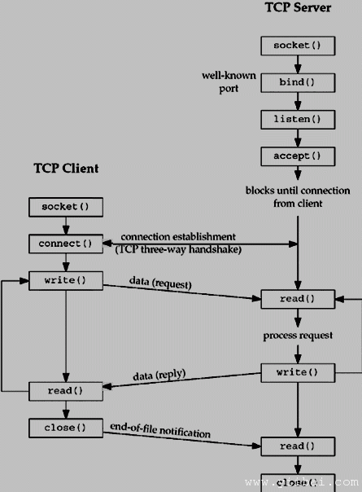

# Socket 客户端服务器模式 架构 - Socket编程

NET应用程序的大部分使用的客户端服务器架构。这些术语指的是两个进程或两个应用程序在相互通信和交换一些信息。两个过程作为一个客户端进程，并另一个进程作为服务器。

## 客户端进程:

这是一个过程，这通常使得信息请求。得到回应后，这一过程可能会终止或可能会做一些其他的处理。

例如**:** 互联网浏览器作为一个客户端应用程序，Web服务器发送一个请求到得到一个HTML网页。

## 服务器进程:

它接受一个来自客户端的请求的过程。获得来自客户端的请求后会处理所需的收集所需的信息，将其发送到请求客户端。一旦这样做完成后，就又变成准备为另一个客户端。服务器进程始终等待准备用于处理传入请求。

**实例:** Web服务器一直等待来自互联网浏览器的请求，并尽快得到任何请求从浏览器，它拿起一个请求的HTML页面，并把它发送回该浏览器。

注意，客户端需要知道的存在服务器的地址，但是服务器并不需要在建立的连接之前知道客户端的地址。一旦建立连接后，双方都可以发送和接收信息。

## 2层和3层架构：

有两种类型的客户端服务器架构：

*   **两层构架:** 在这种架构中，客户端直接与服务器进行交互。这种类型的架构可能有一些安全漏洞和性能问题。 IE浏览器和Web服务器的两层架构。这里的安全问题都解决了使用安全套接字层（SSL）。

*   **三层架构:**在这个架构中，多了一个软件位于客户端和服务器之间。这中间的软件被称为中间件。中间件被用来执行所有的安全检查和重负载情况下的负载平衡。中间件需要从客户端的所有请求，并做必要的验证后，通过向服务器发出请求。然后，服务器没有所需的处理和发送响应回中间件，中间件终于通过这个响应返回给客户端。如果想实现一个3层架构，那么可以使用如Web Logic或WebSphere软件在Web服务器和Web浏览器之间的任何中间件。

## 服务器类型:

有两种类型的服务器上，可以有：

*   **迭代服务器:** 这是最简单形式的服务器的服务进程的客户端和第一个请求，然后完成后，需要从其他客户机的请求。同时，另一个客户端一直等待。

*   并发服务器：这种类型的服务器运行多个进程并发服务请求一次。因为一个进程可能需要更长的时间，但其他客户机又不能等太久。 Unix下写一个并发服务器的最简单的方法是fork一个子进程来分开处理每个客户端。

## 如何创建客户端:

系统调用有所不同的客户端和服务器建立连接，但两者套接字涉及的基本构造。这两个过程分别建立自己的套接字。

在客户端建立套接字所涉及的步骤如下：

1.  创建一个socket可使用_socket()的_系统调用

2.  套接字连接的服务器地址使用connect()系统调用。

3.  发送和接收数据。做到这一点的方法有许多，但最简单的方法是使用 _read()_ 和 _write()_

## 如何创建服务器：

在服务器端建立套接字所涉及的步骤如下：

1.  创建一个socket可使用_socket()的_系统调用

2.  使用bind()系统调用套接字绑定到一个地址。对于互联网上的服务器套接字，地址包括主机的端口号。

3.  连接监听_listen()_系统调用

4.  接受连接使用 _accept()_系统调用。此调用通常会阻塞，直到客户端与服务器连接。

5.  发送和接收数据 _read()_ 和_write()_ 系统调用.

## 客户端和服务器的交互：

以下是完整的客户端和服务器的交互图：

