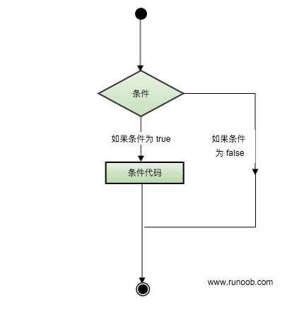

# Swift 条件语句

条件语句通过设定的一个或多个条件来执行程序，在条件为真时执行指定的语句，在条件为 false 时执行另外指定的语句。

可以通过下图来简单了解条件语句的执行过程:



Swift 提供了以下几种类型的条件语句：

| 语句 | 描述 |
| --- | --- |
| [if 语句](/swift/if-statement.html) | **if 语句** 由一个布尔表达式和一个或多个执行语句组成。 |
| [if...else 语句](/swift/if-else-statement.html) | **if 语句** 后可以有可选的 **else 语句**, **else 语句**在布尔表达式为 false 时执行。 |
| [if...else if...else 语句](/swift/if-else-if-else-statement.html) | **if** 后可以有可选的 **else if...else** 语句, **else if...else** 语句常用于多个条件判断。 |
| [内嵌 if 语句](/swift/nested-if-statement.html) | 你可以在 **if** 或 **else if** 中内嵌 **if** 或 **else if** 语句。 |
| [switch 语句](/swift/switch-statement.html) | switch 语句允许测试一个变量等于多个值时的情况。 |

## ? : 运算符

我们已经在前面的章节中讲解了 **条件运算符 ? :**，可以用来替代 **if...else** 语句。它的一般形式如下：

```
Exp1 ? Exp2 : Exp3;

```

其中，Exp1、Exp2 和 Exp3 是表达式。请注意，冒号的使用和位置。

? 表达式的值是由 Exp1 决定的。如果 Exp1 为真，则计算 Exp2 的值，结果即为整个 ? 表达式的值。如果 Exp1 为假，则计算 Exp3 的值，结果即为整个 ? 表达式的值。
