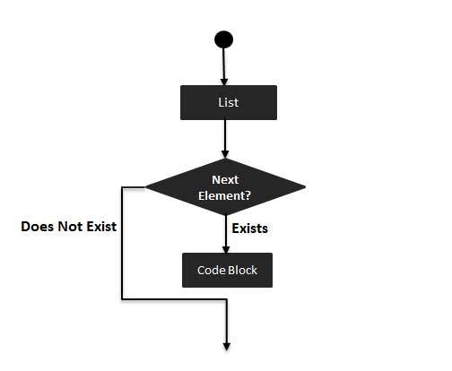

# Swift for-in 循环

Swift for-in 循环用于遍历一个集合里面的所有元素，例如由数字表示的区间、数组中的元素、字符串中的字符。

### 语法

Swift for-in 循环的语法格式如下：

```
for index in var {
   循环体
}
```

**流程图：**



### 实例

```
import Cocoa

var someInts:[Int] = [10, 20, 30]

for index in someInts {
   print( "index 的值为 \(index)")
}
```

以上程序执行输出结果为：

```
index 的值为  10 
index 的值为  20 
index 的值为  30
```

