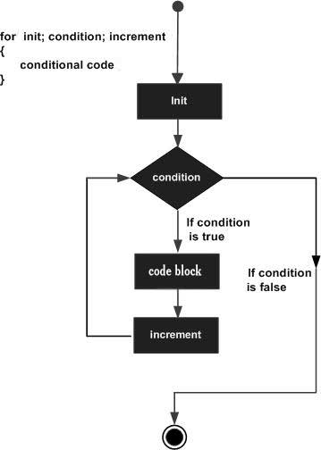

# Swift for 循环

Swift for 循环用来重复执行一系列语句直到达成特定条件，一般通过在每次循环完成后增加计数器的值来实现。

### 语法

Swift for 循环的语法格式如下：

```
for init; condition; increment{
   循环体
}
```

**参数解析：**

1.  **init** 会首先被执行，且只会执行一次。这一步允许您声明并初始化任何循环控制变量。您也可以不在这里写任何语句，只要有一个分号出现即可。
2.  接下来，会判断 **condition**。如果为真，则执行循环主体。如果为假，则不执行循环主体，且控制流会跳转到紧接着 for 循环的下一条语句。
3.  在执行完 for 循环主体后，控制流会跳回上面的 **increment** 语句。该语句允许您更新循环控制变量。该语句可以留空，只要在条件后有一个分号出现即可。
4.  条件再次被判断。如果为真，则执行循环，这个过程会不断重复（循环主体，然后增加步值，再然后重新判断条件）。在条件变为假时，for 循环终止。

**流程图：**



### 实例

```
import Cocoa

var someInts:[Int] = [10, 20, 30]

for var index = 0; index < 3; ++index {
   print( "索引 [\(index)] 对应的值为 \(someInts[index])")
}
```

以上程序执行输出结果为：

```
索引  [0]  对应的值为  10  
索引  [1]  对应的值为  20  
索引  [2]  对应的值为  30
```

