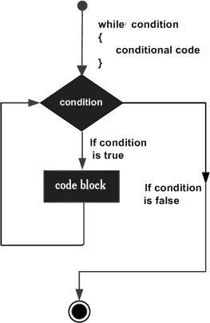

# Swift While 循环

Swift while循环从计算单一条件开始。如果条件为true，会重复运行一系列语句，直到条件变为false。

### 语法

Swift while 循环的语法格式如下：

```
while condition
{
   statement(s)
}

```

语法中的 **statement(s)** 可以是一个语句或者一个语句块。 **condition** 可以是一个表达式。如果条件为true，会重复运行一系列语句，直到条件变为false。

数字 0, 字符串 '0' 和 "", 空的 list(), 及未定义的变量都为 **false** ，其他的则都为 **true**。true 取反使用 **!** 号或 **not**，取反后返回 false。

**流程图：**



### 实例

```
import Cocoa

var index = 10

while index < 20 
{
   print( "index 的值为 \(index)")
   index = index + 1
}

```

以上程序执行输出结果为：

```
index 的值为 10
index 的值为 11
index 的值为 12
index 的值为 13
index 的值为 14
index 的值为 15
index 的值为 16
index 的值为 17
index 的值为 18
index 的值为 19

```

