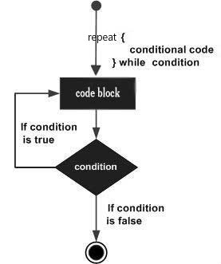

# Swift repeat...while 循环

Swift repeat...while 循环不像 for 和 while 循环在循环体开始执行前先判断条件语句，而是在循环执行结束时判断条件是否符合。

### 语法

Swift repeat...while 循环的语法格式如下：

```
repeat
{
   statement(s);
}while( condition );
```

请注意，条件表达式出现在循环的尾部，所以循环中的 statement(s) 会在条件被测试之前至少执行一次。

如果条件为 true，控制流会跳转回上面的 repeat，然后重新执行循环中的 statement(s)。这个过程会不断重复，直到给定条件变为 false 为止。

数字 0, 字符串 '0' 和 "", 空的 list(), 及未定义的变量都为 **false** ，其他的则都为 **true**。true 取反使用 **!** 号或 **not**，取反后返回 false。

**流程图：**



### 实例

```
import Cocoa

var index = 15

repeat{
    print( "index 的值为 \(index)")
    index = index + 1
}while index < 20
```

以上程序执行输出结果为：

```
index 的值为  15 
index 的值为  16 
index 的值为  17 
index 的值为  18 
index 的值为  19  
```

