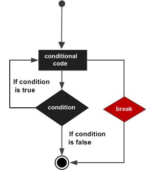

# Swift Break 语句

Swift break语句会立刻结束整个控制流的执行。

如果您使用的是嵌套循环（即一个循环内嵌套另一个循环），break 语句会停止执行最内层的循环，然后开始执行该块之后的下一行代码。

### 语法

Swift break语句的语法格式如下：

```
break

```

**流程图：**



### 实例

```
import Cocoa

var index = 10

repeat{
    index = index + 1

    if( index == 15 ){  // index 等于 15 时终止循环
        break
    }
    print( "index 的值为 \(index)")
}while index < 20

```

以上程序执行输出结果为：

```
index 的值为 11
index 的值为 12
index 的值为 13
index 的值为 14

```
